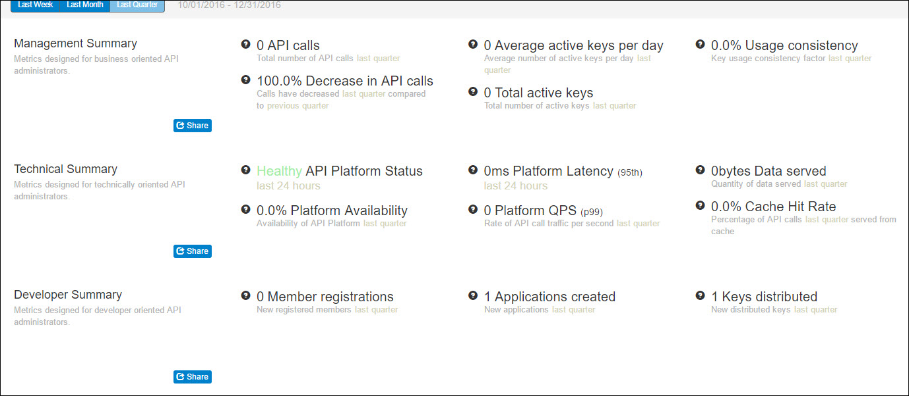

---
sidebar_position: 3
---

# Summary Insights Groups

<head>
  <meta name="guidename" content="API Management"/>
  <meta name="context" content="GUID-d12b1fb6-2ea8-4d50-b069-7e3883b2de51"/>
</head>

The following sets of Summary Insight Groups are available: 

- [Management Summary](SummaryInsightsGroups/Management_summary.md): This group of signals is designed to provide visibility into key API traffic patterns along with an assessment of the API key engagement levels experienced by the API platform. 

- [Technical Summary](SummaryInsightsGroups/Technical_summary.md): This group of signals is designed to provide visibility into key API performance patterns along with assessments of API platform health. 

- [Development Summary](SummaryInsightsGroups/Development_summary.md): This group of signals is designed to provide visibility into key API partner growth along with metrics on API key distribution and application creation.

## Selecting the period of interest for all Summary Insight Groups

All Summary Insight Groups contain metrics and trends with respect to a selected period of interest. Available periods for selection (L**ast Week, Last Month, or Last Quarter**) are with respect to the time span when a user navigates to the feature. 

To view the Executive Summary Insight Groups: 

- Click **Last Week, Last Month or Last Quarter**. 

The respective date range (that is, the start date and the end date) is displayed adjacent to Last Quarter. The **Management Summary, Technical Summary,** and **Developer Summary** are populated according to the selected period. 

:::note

**The Executive Summary** page and the **Heat Map** are populated only if sufficient data is available. For example, if you are a new customer and are using the Control Center for less than a week, the **Executive Summary** page does not display any data. 

:::

The Executive Summary page and the Heat Map are populated only if sufficient data is available. For example, if you are a new customer and are using the API Management Control Center for less than a week, the Executive Summary page does not display any data. 

## View Insight Groups in text-based formats 

Each Summary Insight Group contains a **Share** button to view the respective insights in a text-based format to support efficient selection and sharing. Each insight contains descriptions of the period of interest for clarity. 

To view the management insights in a text-based format, click Share on the **Management Summary Insight Group**.

A window in which Management Summary is displayed in text-based format.
