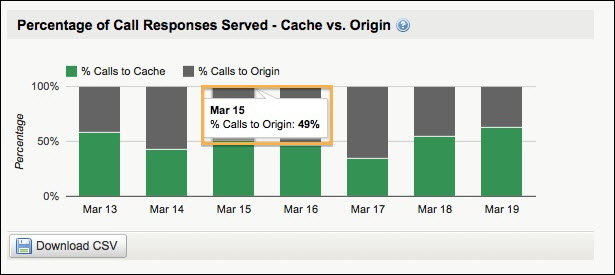

---
sidebar_position: 2
---

# Accessing Reports

<head>
  <meta name="guidename" content="API Management"/>
  <meta name="context" content="GUID-e4456021-175d-4010-a8f6-dfb06744adfa"/>
</head>

Analyze > Reports

By default, the [Summary](Summary/Summary.md) page under the Packages sub-tab is displayed. You can click the Services sub-tab to access reports related to services.

:::note

**Data Disclaimer**: Current day data accuracy, while high, may be under reported slightly as we balance speed of first data availability and accuracy. Within 12 hours, all data should be reported from all points in our distributed network. 

:::

Within the generated report, hovering over certain areas of the chart displays additional information. For example, hovering over the percentage column in the **Percentage of Call Responses Served - Cache vs. Origin** report displays a pop-up for **% Calls to Origin**.

