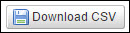

---
sidebar_position: 3
---

# Downloading Reports

<head>
  <meta name="guidename" content="API Management"/>
  <meta name="context" content="GUID-643cf8f5-b327-499c-95a2-63ff97f54db5"/>
</head>

The Reports tab allows you to download all reports CSV files. The **Download CSV** button () is displayed below reports on all pages. By clicking this button, you can download the data included in the report as a plain text file with comma separated values. The downloaded file with .csv extension is supported by almost all spreadsheet and database management software. 
