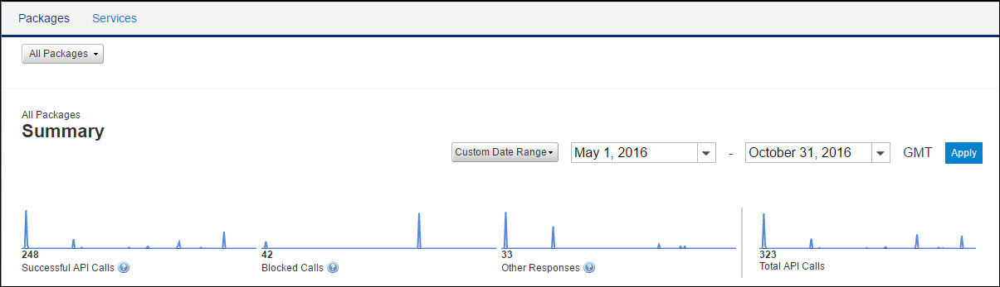

---
sidebar_position: 2
---

# API Usage Report (for All APIs)

<head>
  <meta name="guidename" content="API Management"/>
  <meta name="context" content="GUID-d7c2c073-c7dc-41f4-9a2e-55a819bc4b43"/>
</head>

In this section, spark lines are plotted on a graph to communicate the overall trend of the three categories: **Successful Calls, Blocked Calls,** and **Other Responses**. For more information about API usage, see [API Usage](APIusage/API_usage.md). 

The following table describes the fields in the API usage section. 

|**Field** |**Description** |
| ---- | ---- |
|Successful API Calls|Calls that go through the Traffic Manager without getting blocked or returning any error. |
|Blocked Calls|
Calls that return 403 error for any of the following reasons: 

- Quota or throttle limit is crossed. 

- Developer is inactive. 

- Developer is not authorized. 

- The referrer is unknown. 
|
|Other Responses|
Calls that neither pass through the Traffic Manager nor return the 403 error. They include responses such as: 

- Timeout 

- Invalid key 

- Invalid signatures 

- Resource not found 

- HTTP 3xx series errors 
|
|Total API Calls|The total number of calls made in the selected date range. |

