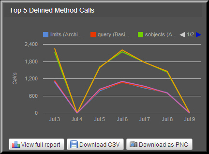
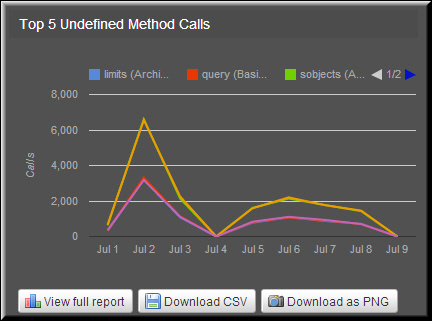
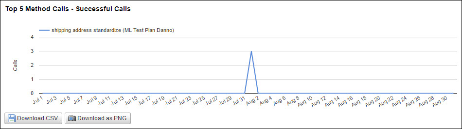
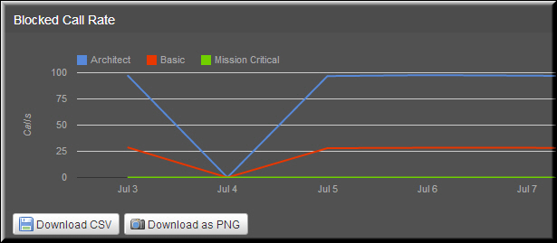
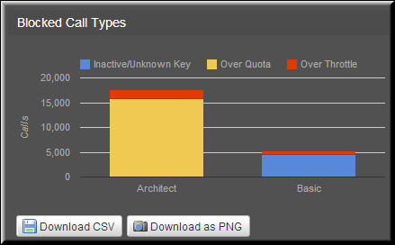

---
sidebar_position: 3
---

# Method Reports for Packages

<head>
  <meta name="guidename" content="API Management"/>
  <meta name="context" content="GUID-90329598-069f-430d-8bea-9fa7f88990d9"/>
</head>

On the Packages sub-tab, you can view reports for defined and undefined methods. You can access all method reports by clicking the All Methods, Defined Methods, and Undefined Methods links in the navigation panel. Each page contains three types of reports, such as successful calls, blocked calls, and other calls. 

:::note

These reports are displayed only on the Packages sub-tab. 

:::

## API Usage > Top 5 Defined Methods Calls

The top five defined methods called in a selected date range are displayed in this report. 

## API Usage > Top 5 Undefined Methods Calls

The top five methods called in a selected date range are displayed in this report. 

## API Usage > Top 5 Method Calls - Successful Calls

The top five methods called in a selected date range are displayed in this report. The report allows you to compare and analyze the methods that are affecting performance of the API. 

## API Usage > Top 5 Method Calls - Blocked Calls

The top five blocked methods called in a selected date range are displayed in this report. The report allows you to compare and analyze the methods that are affecting performance of the API. 

## API Usage > Top 5 Method Calls - Other Calls

The top five methods, other than the successful and blocked calls, called in a selected date range are displayed in this report.

## API Usage > Blocked Call Rate

The percentage of blocked calls is plotted in the report. The percentage is plotted on the Y-axis.

## API Usage > Blocked Call Types

The percentage of blocked call types is plotted in the report as stacked columns. You can analyze and compare the call types that are affecting the API service.

