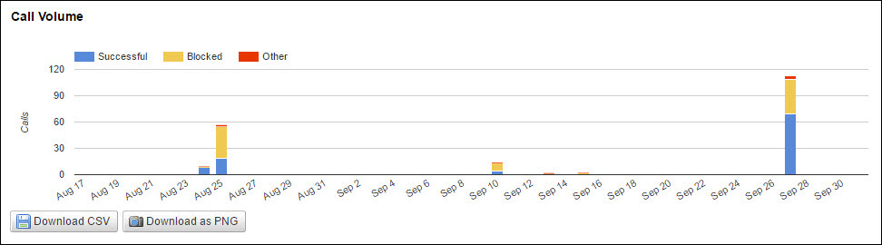
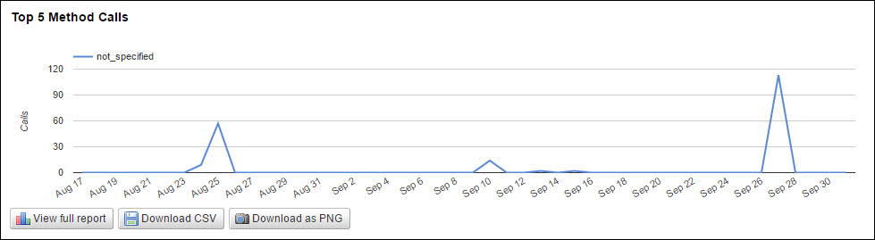

---
sidebar_position: 2
---

# Method Reports for Services

<head>
  <meta name="guidename" content="API Management"/>
  <meta name="context" content="GUID-80d57e1a-d0df-4f32-872a-4e804cdf19b6"/>
</head>

Method reports allow you to analyze the API call traffic at a granular level. On the Services sub-tab, the API Usage: Methods page displays the following reports related to a particular API in a selected date range. 

## API Usage > Call Volume

The Call Volume report plots all API calls in a selected date range. The legends help you compare the successful and blocked calls volume for a particular API.

## API Usage > Top 5 Method Calls

The Top 5 Method Calls report displays the top five method calls by API call volume for the selected API in the selected date range.

