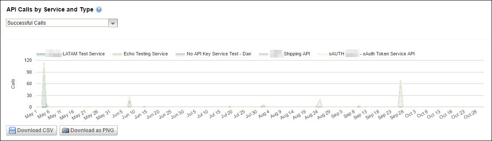
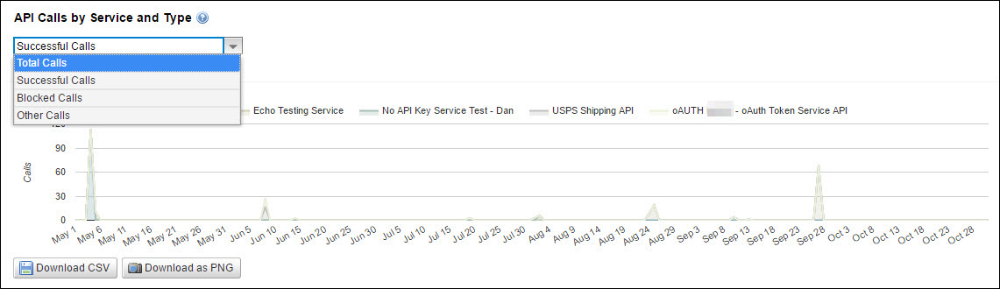

---
sidebar_position: 3
---

# Call Volume by Service or Package Type Report

<head>
  <meta name="guidename" content="API Management"/>
  <meta name="context" content="GUID-d9c82357-39fe-4635-8291-607c04bfe3d3"/>
</head>

In this report, a stacked area chart displays the trends in the API calls made to API services or Packages in a specified time period. This report graphically displays the numerical data represented in the API List or Package List report on the same page. 

:::note

The similar report for Packages can be viewed on the **Packages** sub-tab. You can filter the successful, blocked, and total calls in the report. 

:::

