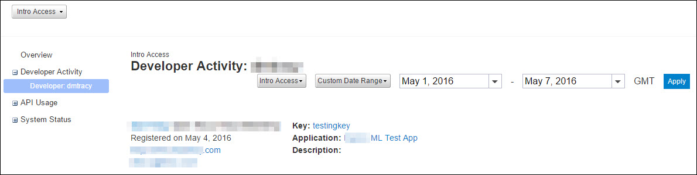

---
sidebar_position: 9
---

# Developer Activity Developer Name

<head>
  <meta name="guidename" content="API Management"/>
  <meta name="context" content="GUID-0c493ebc-97aa-4fc6-89c0-bb3022f070d1"/>
</head>

This page displays the reports that are specific to the selected developer. The reports can be filtered by date or Plan. The developer application, key, email, and registration date are displayed on the page.

:::note

Click a user name on the Developer Activity report to navigate to this page. 

:::

## Developer Activity > Current Quota Usage

A progress bar displays the quota percentage used by the developer. The remaining quota and the number of hours left for the next quota period to start are explicitly displayed.

## Developer Activity > Calls Made

The report displays the number of successful, blocked, and other calls that are made by the developer in the specified time period. 

## Developer Activity > Top 5 Method Calls

The top 5 method calls made by the developer are displayed in the report. 

For more information on method call reports, see [Methods](APIusage/Methods/Methods.md). 

## Developer Activity > Top 5 Error Response Codes

The top 5 error responses received by the developer are displayed in the report. 

For more information, see [Top 5 Error Response Codes](Systemstatus/Errorreports/Top_5_error_response_codes.md). 

## Developer Activity > Map Overlay

The geographic distribution of calls made by the developer is displayed in the report as a heat map.

For more information, see [Geographic Call Distribution](APIusage/Geographic_call_distribution.md). 

## Developer Activity > Data Served

The data served to the developer application is displayed in the report. 

For more information, see [Data Served](Overview/Data_served.md). 
