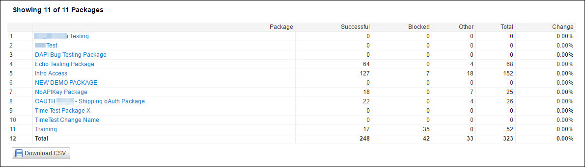

---
sidebar_position: 4
---

# Lists of Packages or APIs Report

<head>
  <meta name="guidename" content="API Management"/>
  <meta name="context" content="GUID-3598dfe5-da18-4b75-a9fc-fc4d045b73bb"/>
</head>

The lists of all APIs or Packages are displayed on the **Summary** page. The reports pertaining to a particular API or a Package can be viewed by clicking the API or the Package name. 

The following table describes the fields in the API and Package list. 

|**Field** |**Description** |
| ----- | ------ |
|APIs/Packages|
The API or Package name. The detailed report can be viewed by clicking the API or the Package name. 

:::note

You can filter the API or Package list to open the detailed reports pertaining to a particular API or a Package. For more information, see [Report Filters](../Report_filters.md).

::: 
|
|Successful|Number of successful calls. |
|Blocked|
Calls that return a 403 error for any of the following reasons: 

- Quota or throttle limit is crossed. 

- Developer is inactive. 

- Developer is not authorized. 

- The referrer is unknown. 
|
|Other|
Calls that neither pass through the Traffic Manager nor return a 403 error. They include responses such as: 

- Timeout 

- Invalid key 

- Invalid signatures 

- Resource not found 

- HTTP 3xx series errors 
|
|Total|Total number of calls made to the API or the Package. |
|Change|The unit-change in total traffic compared to the previous time period recorded. |

