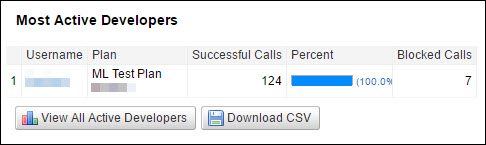

---
sidebar_position: 6
---

# Most Active Developers

<head>
  <meta name="guidename" content="API Management"/>
  <meta name="context" content="GUID-a9c29834-7a56-4780-acbd-73d477c02b93"/>
</head>

This report displays a list of the top 10 most active developers by successful call volume who are using a Package or an API.

The following table describes the fields in the Most Active Developers report. 

|**Field** |**Description** |
| ---- | ---- |
|Username|User or developer name. |
|Plan|The Plan that contains the utilized API Service (applicable to the report displayed on the **Packages** sub-tab). |
|Successful Calls|Number of successful calls. |
|Percent|Percentage of successful calls relative to all API calls received by the Plan for the selected date range. |
|Blocked Calls|
Calls that return 403 error for any of the following reasons: 

- Quota or throttle limit is crossed. 

- Developer is inactive. 

- Developer is not authorized. 

- The referrer is unknown. 
|

:::note

To view the detailed developer activity report, click **View All Active Developers**. For more information, see the [Developer Activity](../Developer_activity.md) section. 

:::
