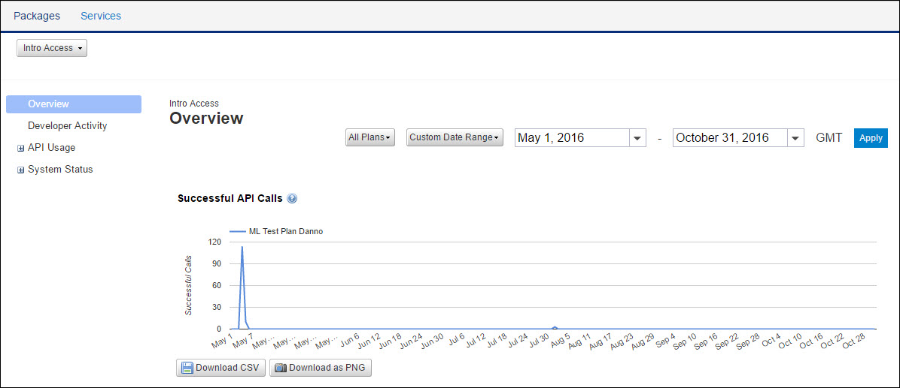

---
sidebar_position: 1
---

# Overview

<head>
  <meta name="guidename" content="API Management"/>
  <meta name="context" content="GUID-30939de6-d1b1-4d1b-be1c-956d3bf0553e"/>
</head>

The Overview page displays reports pertaining to a particular Package or an API. The navigation links on the left panel allow you to view the reports related to the Package or the API. You can filter the reports by Plans, date, month, quarter, or custom date range. For more information, see [Report Filters](../../Report_filters.md). For information on downloading reports, see [Downloading Reports](../../Downloading_reports.md).

The following reports are available on the Overview page: 

- [Successful API Calls](Successful_api_calls.md)

- [API Usage](API_usage_for_specific_api.md)

- [Developer Community](Developer_community.md)

- [Top Method Calls](top-method-calls.htm)

- [Most Active Developers](Most_active_developers.md)

- [Developer Activity](../Developer_activity.md)

- [Data Served](Data_served.md)
