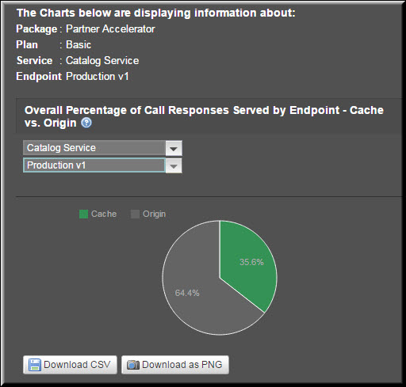
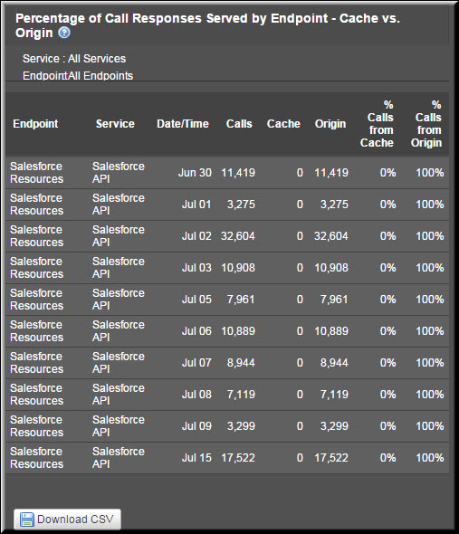
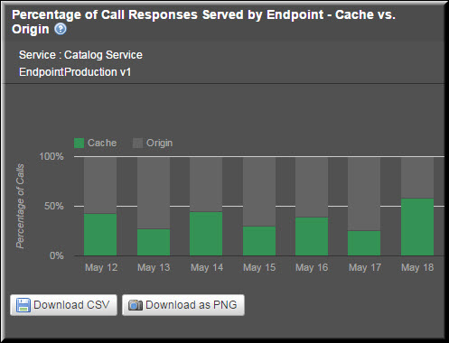

---
sidebar_position: 4
---

# Endpoint-Level Reports

<head>
  <meta name="guidename" content="API Management"/>
  <meta name="context" content="GUID-a2a42736-04a5-4c5b-b57a-2b21fdc772d3"/>
</head>

Endpoint-Level reports include: 

- Overall Percentage of Call Responses Served by Endpoint - Cache vs. Origin (Aggregate) 

- Aggregate Call Responses Served by All Endpoints 

- Aggregate Call Responses Served by an Endpoint 

- Percentage of Call Responses Served by Endpoint - Cache vs. Origin (Trend) 

- Trend in Call Responses Served by All Endpoints 

- Trend in Call Responses by an Endpoint 

## Overall Percentage of Call Responses Served by Endpoint - Cache vs. Origin (Aggregate)

This report displays the aggregate percentage of call responses served by an endpoint. You can select the service and an endpoint for which you want to see the report. On the Packages tab, this report displays the call responses served by an endpoint for the selected Package. By selecting a Plan, you can filter the responses served by the endpoint for that Plan only. Otherwise, if you select the All Plans option, the report displays the responses served by the endpoint for all Plans under the selected Package.

## Aggregate Call Responses Served by All Endpoints

By default, the report displays the numerical data related to call responses served by all endpoints defined under all services associated with all Plans under a Package. To filter this data for a specific Plan or a service, you can select a Plan and a service from the All Plans and the All Services lists, respectively.

The following table describes the fields in the **Overall Percentage of Call Responses Served by Endpoint - Cache vs. Origin** report. 

|**Field** |**Description** |
| ----- | ----- |
|Endpoint|List of all endpoints associated with a specific service (if selected) or all services. |
|Service|List of Services associated with a specific Plan or all Plans. |
|Plan|The Plan with which the services are associated. This Plan is selected from the **All Plans** list. |
|Calls|Total number of calls served for the Plan. This includes the calls served by both the cache and the origin server. |
|Cache|Total number of calls served by the cache. |
|Origin|Total number of calls served by the origin server. |
|% Calls from Cache|Percentage of the total number of calls served by the cache. |
|% Calls from Origin|Percentage of the total number of calls served by the origin. |

## Aggregate Call Responses Served by an Endpoint

After you select a service and an endpoint from the **All Services** and the **All EndPoints** lists, respectively, the report gets refreshed, and the data related to the endpoint is plotted in a pie chart. 

The pie chart in the following image displays the aggregate call responses served by the Production v1 endpoint defined under the **Catalog Service**, which is associated with the **Basic Plan** under the **Partner Accelerator Package**.

## Percentage of Call Responses Served by Endpoint - Cache vs Origin (Trend)

The report displays the percentage trend in call responses served by an endpoint in the specified period. You can select the service and the endpoint for which you want to see the report. A calendar can be used to define the exact time period. By selecting a specific Plan, you can see the trend for that Plan. 

## Trend in Call Responses Served by All Endpoints

By default, the report displays the trend in the call responses served by all endpoints defined under all services associated with all Plans or a specific Plan if selected from the All Plans list. You can select the exact time period from the calendar to see the respective trend in call responses served by all endpoints.

The following table describes the fields in the Percentage of Call Responses Served by Endpoint - Cache vs. Origin report. 

|**Field** |**Description** |
| ---- | ---- |
|Endpoint|List of all endpoints associated with a specific service (if selected) or all services. |
|Service|List of Services associated with a Plan or all Plans. |
|Date/Time|The date range selected from the Custom Date Range list. |
|Calls|Total number of calls served for the Plan. This includes the calls served by both the cache and the origin server. |
|Cache|Total number of calls served by the cache. |
|Origin|Total number of calls served by the origin server. |
|% Calls from Cache|Percentage of the total number of calls served by the cache. |
|% Calls from Origin|Percentage of the total number of calls served by the origin server. |

## Trend in Call Responses by an Endpoint

After you select a service and an endpoint from the All Services and the All EndPoints lists, respectively, the report gets refreshed, and the data related to that endpoint is plotted in a stacked bar chart. 

The following image displays the percentage trend of the call responses served by the Production v1 endpoint defined under the Catalog service for the Partner Accelerator Package:

