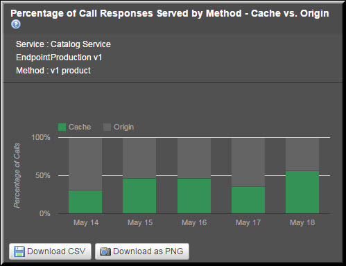

# Method-Level Reports

<head>
  <meta name="guidename" content="API Management"/>
  <meta name="context" content="GUID-b693f420-1cd3-4f17-9ce1-b7f8fdf08a10"/>
</head>

Method-Level reports include: 

- Overall Percentage of Call Responses Served by Method - Cache vs. Origin (Aggregate) 

- Aggregate Call Responses Served by All Methods 

- Aggregate Call Responses Served by a Method 

- Percentage of Call Responses Served by Method - Cache vs Origin (Trend) 

- Trend in Call Responses Served by All Methods 

- Trend in Call Responses by a Method 

## Overall Percentage of Call Responses Served by Method - Cache vs. Origin (Aggregate)

This report displays the aggregate percentage of call responses served by a method. You can select the service, endpoint, and method for which you want to see the report. On the Packages tab, this report displays the call responses served by a method for the selected Package. By selecting a Plan, you can filter the responses served by the method for that Plan only. Otherwise, if you select the All Plans option, the report displays the responses served by the method for all Plans under the selected Package. 

## Aggregate Call Responses Served by All Methods

By default, the report displays the numerical data related to call responses served by all methods defined under all endpoints. To filter this data for a specific service or an endpoint, you can select the service and the endpoint from the All Services and the All endpoints lists, respectively.

The following table describes the fields in the **Overall Percentage of Call Responses Served by Method - Cache vs. Origin** report. 

|**Field** |**Description** |
| ---- | ---- |
|Method|List of methods associated with a specific endpoint (if selected) or all endpoints. |
|Endpoint|List of all endpoints associated with a specific service (if selected) or all services. |
|Calls|Total number of calls served for the Plan. This includes the calls served by both the cache and the origin server. |
|Cache|Total number of calls served by the cache. |
|Origin|Total number of calls served by the origin server. |
|% Calls from Cache|Percentage of the total number of calls served by the cache. |
|% Calls from Origin|Percentage of the total number of calls served by the origin server. |

## Aggregate Call Responses Served by a Method

After you select a service, endpoint, and method from the All Services, All EndPoints, and All Methods lists, respectively, the report gets refreshed, and the data related to the method is plotted in a pie chart. 

The pie chart in the following image displays the aggregate call responses served by the v1 brand method in the Production v1 endpoint defined under the Catalog Service. The service is associated with all Plans under the Partner Accelerator Package.

## Percentage of Call Responses Served by Method - Cache vs Origin (Trend)

The report displays the percentage trend in call responses served by a method in the specified period. You can select the service, endpoint, and method for which you want to see the report. A calendar can be used to define the exact time period. By selecting a specific Plan, you can see the trend for that Plan. 

## Trend in Call Responses Served by All Methods

By default, the report displays the trend in the call responses served by all methods defined under all endpoints. You can select the exact time period from the calendar to see the respective trend in call responses served by all methods. 

The following table describes the fields in the **Percentage of Call Responses Served by Method - Cache vs. Origin** report. 

|**Field** |**Description** |
| ---- | ----- |
|Method|List of methods associated with a specific endpoint (if selected) or all endpoints. |
|Endpoint|List of all endpoints associated with a specific service (if selected) or all services. |
|Date/Time|The date range selected from the Custom Date Range list. |
|Calls|Total number of calls served for the Plan. This includes the calls served by both the cache and the origin server. |
|Cache|Total number of calls served by the cache. |
|Origin|Total number of calls served by the origin server. |
|% Calls from Cache|Percentage of the total number of calls served by the cache. |
|% Calls from Origin|Percentage of the total number of calls served by the origin server. |

## Trend in Call Responses by a Method

After you select a service, endpoint, and method from the **All Services, All EndPoints,** and **All Methods** lists, respectively, the report gets refreshed, and the data related to that method is plotted in a stacked bar chart. 

The stacked bar chart in the following image displays the trend in the call responses served by the **v1 brand** method in the **Production v1 endpoint** defined under the **Catalog Service**.

