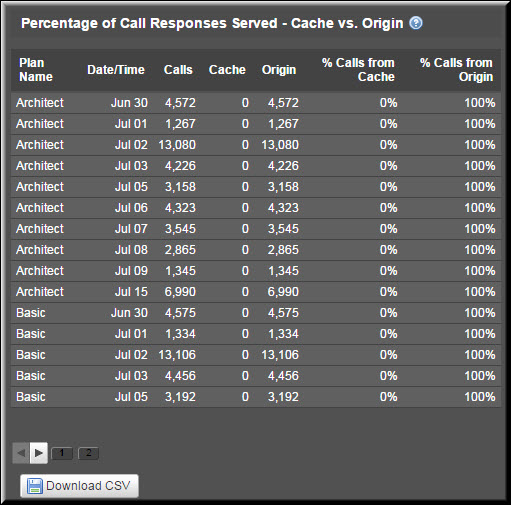

---
sidebar_position: 2
---

# Package-Level Reports

<head>
  <meta name="guidename" content="API Management"/>
  <meta name="context" content="GUID-2e142f39-4a89-43fa-be2d-41258412ff10"/>
</head>

Package-Level reports include: 

- Overall Percentage of Call Responses Served - Cache vs. Origin (Aggregate) 

- Package-Level Aggregate Call Responses 

- Plan or Service-Level Aggregate Call Responses

- Percentage of Call Responses Served - Cache vs. Origin (Trend) 

- Package-Level Call Response Trend 

- Plan or Service-Level Call Response Trend 

## Overall Percentage of Call Responses Served - Cache vs. Origin (Aggregate)

The report displays the percentage of call responses served by the cache and the origin server. This report can be generated for a particular Service, Plan, or Package. 

:::note

The Package report is displayed in a numerical table format, whereas a similar report for a Plan or a service is displayed using a pie chart. 

:::

## Package-Level Aggregate Call Responses

You can select a Plan from the All Plans list to view the report specific to that Plan. 

The following table describes the fields on the Overall Percentage of Call Responses Served - Cache vs. Origin report. 

|**Field** |**Description** |
| --- | ----- |
|Plan Name|List of all Plan names in the selected Package. |
|Calls|Total number of calls served for the Plan. This includes the calls served by both the cache and the origin server. |
|Cache|Total number of calls served by the cache. |
|Origin|Total number of calls served by the origin server. |
|% Calls from Cache|Percentage of the total number of calls served by the cache. |
|% Calls from Origin|Percentage of the total number of calls served by the origin server. |

## Plan or Service-Level Aggregate Call Responses

The Overall Percentage of Call Responses Served - Cache vs. Origin report displays a pie chart for a service or a Plan. 

## Percentage of Call Responses Served - Cache vs. Origin (Trend)

The report displays the percentage trend in the call responses served by the cache and the origin server by date and time. This report can be generated for a particular service, Plan, or Package. 

:::note

The Package report is displayed in a numerical table format, whereas a similar report for a Plan or a service is displayed using a stacked bar chart.

:::

## Package-Level Call Response Trend

The following image displays the **Percentage of Call Responses Served - Cache vs. Origin** report for all Plans under the **Internal Business Application Package**. You can select a Plan from the All Plans drop-down to view the report specific to that Plan.

The following table describes the fields in the **Percentage of Call Responses Served - Cache vs. Origin** report. 

|**Field** |**Description** |
| --- | --- |
|Plan Name|List of all Plan names in the selected Package by the specified date and time. |
|Date/Time|The date range selected from the Custom Date Range list. |
|Calls|Total number of calls served for the Plan by the specified date and time. This includes the calls served by both the cache and the origin server. |
|Cache|Total number of calls served by the cache by the specified date and time. |
|Origin|Total number of calls served by the origin server by the specified date and time. |
|% Calls from Cache|Percentage of the total number of calls served by the cache by the specified date and time. |
|% Calls from Origin|Percentage of the total number of calls served by the origin server by the specified date and time. |

## Plan or Service-Level Call Response Trend

The **Percentage of Call Responses Served - Cache vs. Origin** report displays a stacked bar chart for a service or a Plan. 
