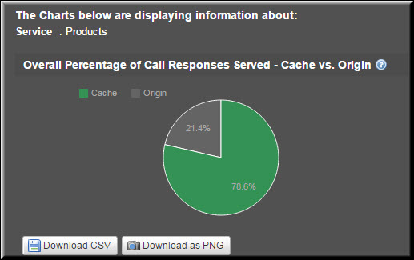
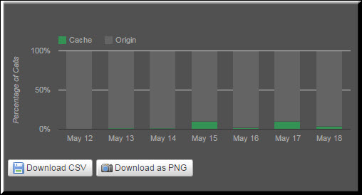

---
sidebar_position: 3
---

# Service-Level Reports

<head>
  <meta name="guidename" content="API Management"/>
  <meta name="context" content="GUID-e523ad03-26b0-4379-909a-1f70d2c2c1de"/>
</head>

Service-Level reports include: 

- Overall Percentage of Call Responses Served by Service - Cache vs. Origin (Aggregate)

- Aggregate Call Responses Served by All Services 

- Overall Percentage of Call Responses Served by Service - Cache vs. Origin

- Aggregate Call Responses Served by a Service 

- Percentage of Call Responses Served by Service - Cache vs Origin (Trend) 

- Trend in Call Responses Served by All Services 

- Percentage of Call Responses Served by Service - Cache vs. Origin 

- Trend in Call Responses by a Service 

## Overall Percentage of Call Responses Served by Service - Cache vs. Origin (Aggregate)

This report displays the percentage of call responses served by a service. You can select the service for which you want to see the report. 

On the **Packages** tab, this report displays the call responses served by a service for the selected Package. By selecting a Plan, you can filter the responses served by the service for that Plan only. Otherwise, if you select the All Plans option, the report displays the responses served by the service for all Plans under the selected Package. 

## Aggregate Call Responses Served by All Services

By default, the report displays the numerical data related to call responses served by all services associated with all Plans under a Package. To filter this data for a specific Plan, you can select a Plan from the All Plans list.

## Overall Percentage of Call Responses Served by Service - Cache vs. Origin

The following table describes the fields in the **Overall Percentage of Call Responses Served by Service - Cache vs. Origin** report. 

|**Field** |**Description** |
| --- | ----- |
|Service|List of services associated with a Plan or all Plans. |
|Plan|The Plan with which the services are associated. This Plan is selected from the All Plans list. |
|Calls|Total number of calls served for the Plan. This includes the calls served by both the cache and the origin server. |
|Cache|Total number of calls served by the cache. |
|Origin|Total number of calls served by the origin server. |
|% Calls from Cache|Percentage of the total number of calls served by the cache. |
|% Calls from Origin|Percentage of the total number of calls served by the origin server. |

## Aggregate Call Responses Served by a Service

After you select a service from the All Services list, the report gets refreshed, and the data related to the service is plotted in a pie chart. 

The pie chart in the following image displays the aggregate call responses served by the Products service:

## Percentage of Call Responses Served by Service - Cache vs Origin (Trend)

The report displays the percentage trend in call responses served by a service in the specified period. You can select the service for which you want to see the report. A calendar can be used to define the exact time period. By selecting a specific Plan, you can see the trend for that Plan. 

## Trend in Call Responses Served by All Services

By default, the report displays the trend in the call responses served by all services associated with all Plans or a specific Plan if selected from the All Plans list. You can select the exact time period from the calendar to see the respective trend in call responses served by all services. 

## Percentage of Call Responses Served by Service - Cache vs. Origin

 

|**Field** |**Description** |
| ---- | ----- |
|Service|List of services associated with a Plan or all Plans. |
|Plan|The Plan with which the services are associated. This Plan is selected from the All Plans list. |
|Date/Time|The date range selected from the Custom Date Range list. |
|Calls|Total number of calls served for the Plan. This includes the calls served by both the cache and the origin server. |
|Cache|Total number of calls served by the cache. |
|Origin|Total number of calls served by the origin server. |
|% Calls from Cache|Percentage of the total number of calls served by the cache. |
|% Calls from Origin|Percentage of the total number of calls served by the origin server. |

## Trend in Call Responses by a Service

After you select a service from the **All Services** list, the report gets refreshed, and the data is plotted in a stacked bar chart. 

The following image displays the percentage trend of the call responses served by the Catalog service for the **Premium Plan** under the **Partner Accelerator Package**:

 
