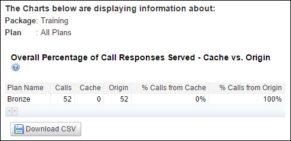

---
sidebar_position: 1
---

# Cache Reports

<head>
  <meta name="guidename" content="API Management"/>
  <meta name="context" content="GUID-d19fc0e3-62b0-49eb-8179-ed7eb9d87926"/>
</head>

On the Cache tab, reports display the comparison of the cache responses served by API Management in the cache and the responses that are served by the origin server. By viewing the trend in the cache responses, the Reports Managers can analyze the cache performance of various Packages, Plans, Services, and Endpoints responses. 

All charts such as pie charts and bar charts can be viewed interactively. For more information about reports interactivity, see [Reports Interactivity](../reports_interactivity.md). 

The following image displays the Cache sub-tab on the Packages tab. 

The following reports are available on the Cache tab: 

- [Package-Level Reports](./Package_level_reports.md)

- [Service-Level Reports](./Service_level_reports.md)

- [Endpoint-Level Reports](./Endpoint_level_reports.md)

- [Method-Level Reports](./Method_level_reports.md)

- [Developer Reports](./developer_reports.md)
