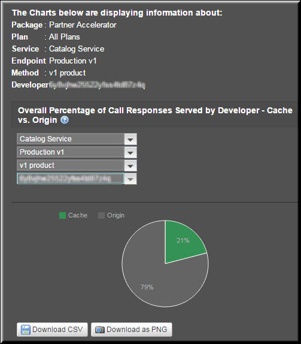
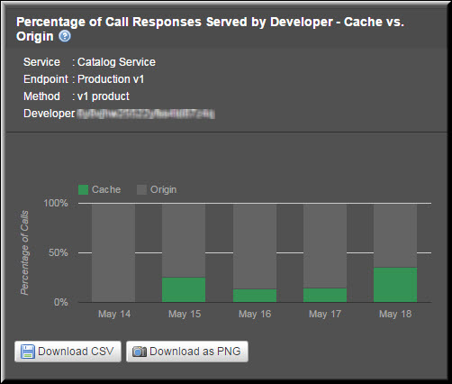

---
sidebar_position: 6
---

# Developer Reports

<head>
  <meta name="guidename" content="API Management"/>
  <meta name="context" content="GUID-3b00f455-e2de-4e37-b000-2bd8587da38b"/>
</head>

Developer reports include: 

- Overall Percentage of Call Responses Served by Developer - Cache vs. Origin (Aggregate) 

- Aggregate Call Responses Served by All Developers 

- Aggregate Call Responses Served by a Developer 

- Percentage of Call Responses Served by Developer - Cache vs Origin (Trend) 

- Trend in Call Responses Served by All Developers 

- Trend in Call Responses by a Developer 

## Overall Percentage of Call Responses Served by Developer - Cache vs. Origin (Aggregate)

This report displays the overall percentage of call responses served for a specific Package key or API key. This report is displayed on both the Services and Packages tabs. On the Packages tab, you can select a specific Plan to view the responses served only from that Plan. 

## Aggregate Call Responses Served by All Developers

By default, the report displays the numerical data related to call responses served for all developers. Here, the data is generated for a Package key and not for a developer. By default, the **All Services, All Endpoints, All Methods,** and **All Developers** options are selected. You can filter the call responses data for a specific service, endpoint, or method by selecting the appropriate options.

The following table describes the fields in the **Overall Percentage of Call Responses Served by Developer - Cache vs. Origin report**. 

|**Field** |**Description** |
| ---- | --- |
|Developer API Key|A key generated for a developer when the application is registered on the Portal. By using this key, a developer can access a specific service or a Package. |
|Methods|The method that serves the response to the Package or the API key. |
|Calls|Total number of calls served for the Plan. This includes the calls served by both the cache and the origin server. |
|Cache|Total number of calls served by the cache. |
|Origin|Total number of calls served by the origin server. |
|% Calls from Cache|Percentage of the total number of calls served by the cache. |
|% Calls from Origin|Percentage of the total number of calls served by the origin server. |
|Username|Name of the user for logon purposes. This is the primary identifier for the user in the API Management system. |
|Application|The registered application for which the key is generated. |
|Email|Email address of the registered user account. |

## Aggregate Call Responses Served by a Developer

After you select a developer or a key from the **All Developers** list, the report gets refreshed, and the data related to the endpoint is plotted in a pie chart. 

The pie chart in the following image displays the aggregate call responses served for a Package key by the **Catalog service, Production v1 endpoint,** and **v1 product** method, for all Plans, under a **Partner Accelerator** Package.

## Percentage of Call Responses Served by Developer - Cache vs Origin (Trend)

The report displays the percentage trend in call responses served for a Package key in the specified period. You can select the service, endpoint, and method for which you want to see the report. A calendar can be used to define the exact time period. By selecting a specific Plan, you can see the trend for that Plan. 

## Trend in Call Responses Served by All Developers

By default, the report displays the trend in the call responses served by all developers. Here, the data is generated for a Package key and not for a developer. By default, the **All Services, All Endpoints, All Methods,** and **All Developers** options are selected. You can select the exact time period from the calendar to see the respective trend in call responses served by all developers or Package keys.

The following table describes the fields in the Percentage of Call Responses Served by Developer - Cache vs. Origin report. 

|**Field** |**Description** |
| ----- | ----- |
|Developer API Key|A key generated for a developer when the application is registered on the Portal. By using this key, a developer can access a specific service or a Package. |
|Methods|The method that serves the response to the Package or the API key. |
|Date/Time|The date range selected from the Custom Date Range list. |
|Calls|Total number of calls served for the Plan. This includes the calls served by both the cache and the origin server. |
|Cache|Total number of calls served by the cache. |
|Origin|Total number of calls served by the origin server. |
|% Calls from Cache|Percentage of the total number of calls served by the cache. |
|% Calls from Origin|Percentage of the total number of calls served by the origin server. |
|Username|Name of the user for login purposes. This is the primary identifier for the user in the API Management system. |
|Application|The registered application for which the key is generated. |
|Email|Email address of the registered user account. |

## Trend in Call Responses by a Developer

After you select a developer or a key from the All Developers list, the report gets refreshed, and the data related to the developer or the key is plotted in a stacked bar chart. 

The stacked bar chart in the following image displays the aggregate call responses served for a Package key by the **Catalog service, Production v1 endpoint, and v1 product** method, for all Plans, under a **Partner Accelerator** Package.

