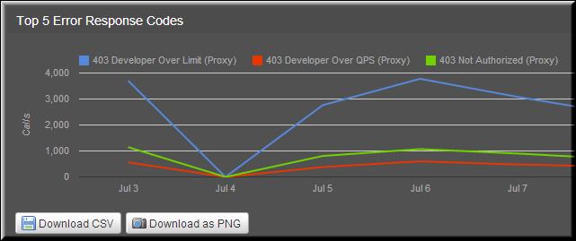

---
sidebar_position: 3
---

# Top 5 Error Response Codes

<head>
  <meta name="guidename" content="API Management"/>
  <meta name="context" content="GUID-0e526344-e17e-4579-8154-5ea4eed0a69e"/>
</head>

The top five error response codes by volume are displayed in this report. Legends are used to distinguish the error codes. This report is displayed on the Services tab. 

