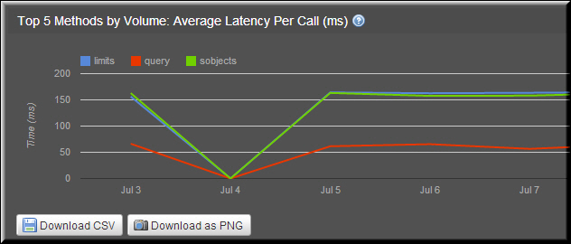

---
sidebar_position: 3
---

# Top 5 Methods by Volume Average Latency per Call (ms)

<head>
  <meta name="guidename" content="API Management"/>
  <meta name="context" content="GUID-0f359aaf-9bed-4494-ac7b-26a0a85c9cfc"/>
</head>

The top five methods with high volume of average latency per call are displayed in this report. This report allows you to analyze the methods that affect the average latency. 

