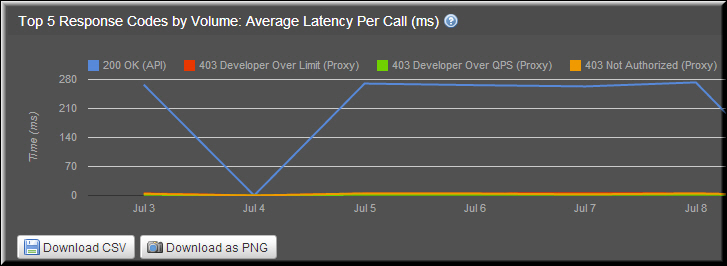

---
sidebar_position: 4
---

# Top 5 Response Codes by Volume Average Latency per Call (ms)

<head>
  <meta name="guidename" content="API Management"/>
  <meta name="context" content="GUID-06cd4d28-7956-4641-9f6c-bcaf53f8f78c"/>
</head>

The top five response codes with high volume of average latency per call are displayed in this report. The report allows you to analyze the response codes that affect the average latency. 

