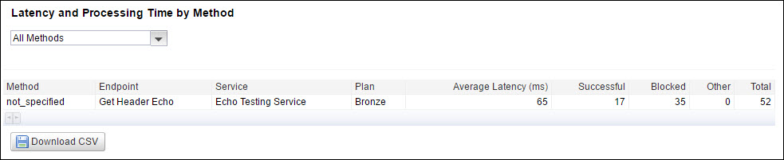

---
sidebar_position: 5
---

# Latency and Processing Time

<head>
  <meta name="guidename" content="API Management"/>
  <meta name="context" content="GUID-74a48a86-b191-487e-a530-f5d942e958bc"/>
</head>

The latency and processing time of all methods and response codes are listed in the Latency and Processing Time by report. Latency is the time added by the Traffic Manager to the processing time by the customer's backend system. Processing time is the total time taken by the request (Latency + Customer backend processing time). The following image displays the list of methods and the respective latency and processing time values. 

:::note

You can filter the latency and processing time values by methods or response codes. 

:::

The following table describes the fields in the **Latency and Processing Time** by report. 

|**Field** |**Description** |
| ------ | ------- |
|Method/Response Code|The method or response code name. |
|Average Latency (sec)|Average total latency (in seconds) per call. |
|Total Call Volume|Total call volume for the method or the response code. |
|API Management Processing Time (sec)|Average time (in seconds) taken by the Traffic Manager to process the calls for the method. |
|API Processing Time (sec)|Average time (in seconds) taken by the calls to complete the round trip from the Traffic Manager to the client server. |
|Total Latency (sec)|Total average latency (in seconds) for all calls. (API Management processing time + API processing time). |
|Percent|Percent of total latency associated with the method or the response. |

:::note

Package related latency reports can be viewed on the Packages sub-tab. You can filter the Package-related latency and processing time data in the similar report. 

:::
