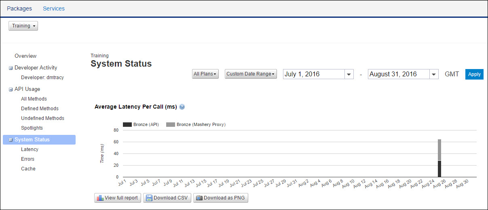

---
sidebar_position: 1
---

# System Status

<head>
  <meta name="guidename" content="API Management"/>
  <meta name="context" content="GUID-ee92497d-59f5-4499-b57e-1745c0843bee"/>
</head>

The reports related to system responses are displayed in the System Status page. The performance of the Traffic Manager, cache, and response codes returned in the process can be analyzed in the page. 

The page can be accessed by clicking the System Status link in the navigation panel. 

The following reports are displayed in the System Status page: 

- [Average Latency Per Call](Latencyreports/Average_latency_per_call_ms.md)

- [Top 5 Error Response Codes](Errorreports/Top_5_error_response_codes.md)

- [Error Rate](Errorreports/Error_rate.md)

For information on downloading reports, see [Downloading Reports](../../Downloading_reports.md). 
