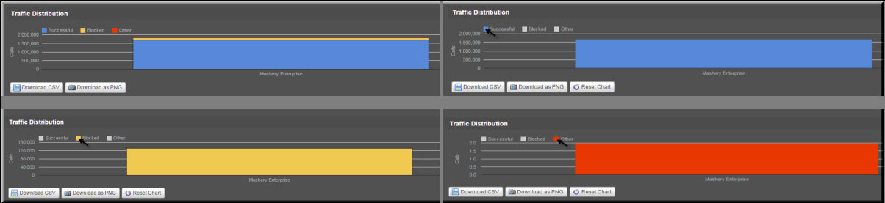
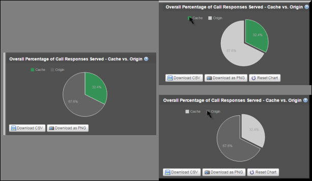

---
sidebar_position: 7
---

# Reports Interactivity

<head>
  <meta name="guidename" content="API Management"/>
  <meta name="context" content="GUID-8dbe7848-4cf1-434a-b4ad-f653fedae339"/>
</head>

The API Management reports, being interactive in nature, can be used optimally by the Reports Managers. Each legend in the charts is programmed to display only the data related to that legend, hiding the data related to other legends. When the report displays large amount of complex data, the legends can be used interactively to view a particular chart in an optimum view. 

## Example 1: Stacked bar chart

## Example 2: Pie chart

## Resetting the Chart

The charts can be reset by clicking the Reset Chart button. By resetting a chart, you display the standard view of the chart. 
