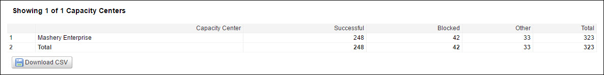

---
sidebar_position: 5
---

# List of Capacity Centers Report

<head>
  <meta name="guidename" content="API Management"/>
  <meta name="context" content="GUID-db009c2b-275c-46e7-83f4-568e2f307574"/>
</head>

A capacity center refers to a capacity cluster within a deployment type. There can be multiple capacity centers within a deployment type. For example, Boomi Cloud™ API
Management - Local Edition allows clients to define one or more capacity centers. 

The following table describes the fields in the Capacity Center list. 

|**Field** |**Description** |
| ----- | ---- |
|Capacity Center|The capacity center name. |
|Successful|Number of successful calls. |
|Blocked|
Calls that return a 403 error for any of the following reasons: 

- Quota or throttle limit is crossed. 

- Developer is inactive. 

- Developer is not authorized. 

- The referrer is unknown. 
|
|Other|
Calls that neither pass through the Traffic Manager nor return a 403 error. They include responses such as: 

- Timeout 

- Invalid key 

- Invalid signatures 

- Resource not found 

- HTTP 3xx series errors 
|
|Total|Total number of calls made to the capacity center. |
|Change|The unit-change in total traffic from the previous time period recorded. |

