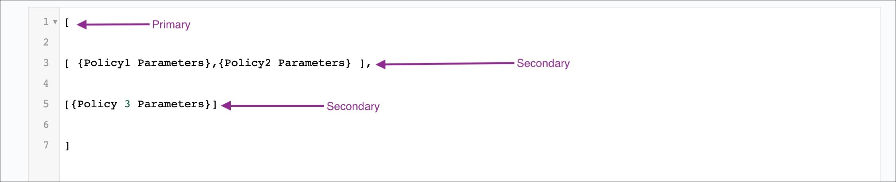
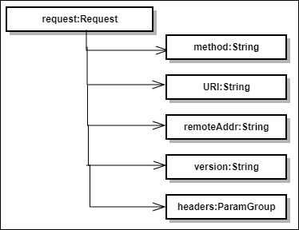
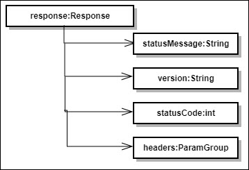

---
sidebar_position: 3
---

# Design and Implementation

<head>
  <meta name="guidename" content="API Management"/>
  <meta name="context" content="GUID-f98259fd-21f8-42f0-98d7-b309564ccf0a"/>
</head>

## Policy Structure

Policy can be defined in the below structure: 

```xml
[

[ {Policy1 Parameters},{Policy2 Parameters} ],

[{Policy 3 Parameters}]

]
```



## Important Points about Policy Structure

- Policy for API is defined under pre-input parameter Policies. 

- Policies should contain valid JSON array. 

- Policies consists of two types of JSON arrays: 

  - Primary JSON array and secondary JSON array. 

  - Primary JSON Array is the main JSON array defined under Policies. Each element of Primary JSON array can contain secondary JSON array, which is JSON array of policies.

- For elements of Primary JSON array, evaluation is done in AND manner while for element of Secondary JSON Array, evaluation is done in OR manner. 

  - This means you can define above policy structure as ((Policy1 || Policy2) && Policy3). 

- In case any element of Primary JSON array is not successfully evaluated, then further elements of Primary JSON Array are not evaluated because evaluation manner for Primary JSON Array is AND. 

- Policy is evaluated in the order in which they are defined, for example, policy, which is specified first is evaluated first. 

- If none of the parameters for policy are defined, then that policy is ignored. For the following example configuration, if statusMessage for response equals Success, then the call is forwarded otherwise, the call is blocked. 

```json
[
  [{}],
  [{
    "Name": "Match",
    "Operation": "ContainsAll",
    "Context": "Response",
    "ArgumentLocation": "${response.statusMessage}",
    "MatchExpression": ["Success"],
    "Effect" : "Allow"
  }]
]
```

## Context Object Structure

**Request Object Structure**



**Request Object Description** 

|**S#** |**Request Object Field Name** |**Field Description** |**Field Name in Request** |**Argument Location Example** |
| --- | --- | --- | --- | --- |
|1 |Method |Contains HTTP method like GET, POST |method |`${request.method}` |
|2 |URI |Contains request uri like /aj2068?api\_key=g8nftwaew4srgh6p95k7d4cd |URI |`${request.URI}` |
|3 |Remote Address |Contains origin server IP |remoteAddr |`${request.remoteAddr}`|
|4 |Version |Contains HTTP version for request, such as HTTP/1.1|version |`${request.version}` |
|5 |Headers |Contains all request headers |headers |`${request.headers.get('Header Name')}` |

:::note

Only field names listed in above table is supported for match policy for Request context. 

:::

**Response Object Structure**



**Response Object Description** 

|**S#** |**Request Object Field Name** |**Field Description** |**Field Name in Request** |**Argument Location Example** |
| --- | --- | --- | --- | --- |
|1 |Response Status Message |Contains response status message |statusMessage |`${response.statusMessage}` |
|2 |Version |Contains HTTP version for response like HTTP/1.1 |version |`${response.version}` |
|3 |Response Status Code |Contains response status code |statusCode |`${response.statusCode}` |
|4 |Headers |Contains all response headers |headers |`${response.headers.get('Header Name')}` |

:::note

Only field names listed in above table is supported for match policy for Response context. 

:::

## Error Messages

|**Error Name** |**HTTP Status Code** |**Cause** |
| --- | --- |----|
|PolicyFailure|403 |Defined policies are not evaluated successfully. |
|InvalidJSONForPolicy |403 |Defined policies are not in valid JSON format. |
|InvalidJSONFormatForPolicy|403 |JSON for policies is valid but policies are not defined as List in defined JSON. |
|InvalidPolicyName|403 |Policy name for any one of the defined policy is not correct. |
|PolicyNameNotSpecified|403 |Policy name for any one of the defined policy is not specified. |
|InvalidMatchPolicyOperation|403 |Match operation for any one of the defined match policy is not correct. |
|MatchPolicyOperationNotSpecified|403 |Match operation for any one of the defined match policy is not specified. |
|InvalidMatchPolicyContext|403 |Context for any one of the defined match policy is not correct. |
|MatchPolicyContextNotSpecified|403 |Context for any one of the defined match policy is not specified. |
|MatchPolicyContextUnavailable|403 |Required Context is not configured in policy. |
|InvalidMatchPolicyArgumentLocation|403 |Argument Location for any one of the defined match policy is not defined as String. |
|MatchPolicyArgumentLocationNotSpecified|403 |Argument Location for any one of the defined match policy is not specified. |
|InvalidMatchPolicyExpression|403 |Match Expression for any one of the defined match policy is not defined as list. |
|MatchPolicyExpressionNotSpecified|403 |Match Expression for any one of the defined match policy is not specified. |
|MatchExpressionNotEvaluatedAsString|403 |Match Expression should be defined as an array of list. If that list does not contain String value, this exception is thrown. |
|MatchPolicyArgumentLocationEvaluationError|403 |Java unified expression for argument location for any one of the defined match policy is not evaluated successfully or argument location evaluation does not result in string, integer, array of string or array of integer. |
|ArgumentDoesNotContainAnyDefinedMatchExpression|403 |Argument Does not matches with any defined expression for match policy type ContainsAny. |
|ArgumentDoesNotContainAllDefinedMatchExpressions|403 |Argument Does not matches with any defined expression for match policy type ContainsAll. |
|MatchOperationNotSupportedForPayload|403 |Match Operation is not supported for payload processing. |
|MatchOperationSupportedOnlyForPayload|403 |Match Operation only supports payload processing. |
|InvalidMatchPolicyEffect |403 |Value in the effect parameter of match policy defined anything except Allow, Deny. |
|AccessDeniedDueToMatchPolicyDenyEffect|403 |Call is blocked as one of the defined match policy with effect as "Deny" has been evaluated successfully. |
