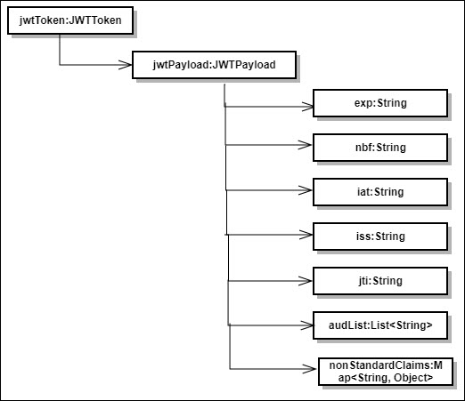

---
sidebar_position: 2
---

# Design and Implementation

<head>
  <meta name="guidename" content="API Management"/>
  <meta name="context" content="GUID-edd2a6c4-a14d-45b9-b317-d152543502f9"/>
</head>

## Policy Structure

Refer to the [API Policy Structure](../Design_and_implementation_7.md). 

## Important Points about Policy Structure

Refer to the [API Policy Important Points about Policy Structure](../Design_and_implementation_7.md).

## Policy Usage

Refer to the [API Policy Policy Usage](../Usage_7.md). 

## Claims Verification Policy Parameters

- Name: This field contains the policy name. In case of JWT claims verification policy, it is always "JWTClaimsVerificationPolicy". 

- TokenExpiryOverride: This field defines time which overrides JWT expiry time. 

- Iss: This field defines Issuer of the JWT. 

- Aud: This field defines recipient for which the JWT is intended. 

- NonStandardClaims: This field defines non standard claims to be match with JWT claims. 

## JWT Claims Structure Under JWT Token Object

## JWT Standard Claims

- iss (issuer): Issuer of the JWT 

- sub (subject): Subject of the JWT (the user) 

- aud (audience): Recipient for which the JWT is intended 

- exp (expiration time): Time after which the JWT expires 

- nbf (not before time): Time before which the JWT must not be accepted for processing 

- iat (issued at time): Time at which the JWT was issued; can be used to determine age of the JWT 

- jti (JWT ID): Unique identifier; can be used to prevent the JWT from being replayed (allows a token to be used only once) 

## Error Messages

This section lists error messages that are specific to JWT Claims Validation Policy. For a complete list of error messages.

|**Error Name** |**HTTP Status Code** |**Cause** |
| ---- | ----- | --- |
|InvalidJWTClaimsPolicyArgumentTokenExpiryOverride|403 |Token Expiry Override is not correct. |
|JWTClaimsPolicyArgumentTokenExpiryOverrideNotSpecified|403 |Token Expiry Override is not specified. |
|InvalidJWTClaimsPolicyArgumentNonStandarnClaims|403 |Defined Non Standard Claims are not correct. |
|JWTClaimsPolicyArgumentNonStandarnClaimsNotSpecified|403 |Non Standard Claims are not specified. |
|InvalidJWTClaimsPolicyArgumentAudience|403 |Defined Audience details are not correct. |
|JWTClaimsPolicyArgumentAudienceNotSpecified|403 |Audience details are not specified. |
|InvalidJWTClaimsPolicyArgumentIssuer|403 |Defined Issuer details are not correct. |
|JWTClaimsPolicyArgumentIssuerNotSpecified|403 |Issuer details are not specified. |
|NonStandardClaimIsNotAuthorized|403 |Non Standard Claim is not authorized. |
|AudIsNotAuthorized|403 |Audience is not authorized. |
|AudNotConfiguredInJWTToken|403 |Audience is not configured in the incoming JWT token. |
|InvalidIssWithMultipleValues|403 |Incoming JWT token Issuer claim have multiple values. |
|IssNotAuthorized|403 |Issuer is not authorized. |
|IssNotConfiguredInJWTToken|403 |Issuer is not configured in the incoming JWT token. |
|IatGreaterThanCurrentTime|403 |Time at which the JWT was issued is greater than current time. |
|IatGreaterThanExpTime|403 |Time at which the JWT was issued is greater than expiry time. |
|IatIsNonNumeric|403 |Time at which the JWT was issued is non numeric integer. |
|TokenNotAllowedBeforeNbf|403 |Token not allowed before Nbf. |
|NbfIsNonNumeric|403 |Nbf is non numeric integer. |
|ExpIsNonNumeric|403 |Expiry time is non numeric integer. |
|TokenExpiryOverrideOrIatIsNonNumeric|403 |Token Expiry Override or JWT Issued time is non numeric integer. |
|TokenExpired|403 |JWT token is expired. |

## Business Rules Assumptions

The following scenarios are not supported in the policy: 

- If API Key is passed in JWT token payload. 

- If non-standard claims are passed as array in JWT token payload. 
