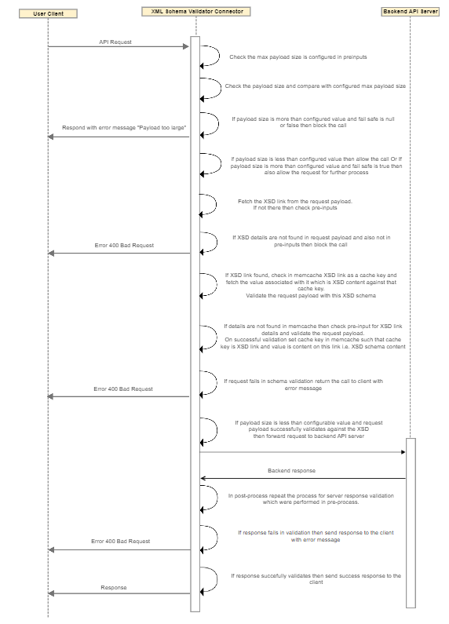

---
sidebar_position: 3
---

# Design and Implementation

<head>
  <meta name="guidename" content="API Management"/>
  <meta name="context" content="GUID-fd1117e8-9d99-4c31-86d1-d885bfe66dd9"/>
</head>

## Sequence Diagram

## Implementation Details

- If max payload size is configured in pre-inputs, then check size of the payload and compare it with the configurable value.
 
- If payload size is more than configured value, and fail-safe is null or false; then request is sent back to the user client with the error message "Payload Too Large". 

- If payload is more than configurable value, and fail-safe is true; then allow the call for further processing. Capture warning message in debug log. 

- if payload size is less than configured value, then allow the call for further processing.

- If max payload size is not configured in pre-inputs, then allow the call for further processing. 
- Check the XSD link details from payload if not there then check the pre-inputs. 

- Check the Memcache for cache key as XSD link and fetch the value associated with it which is XSD content. Validate the request payload with this XSD schema.

- If XSD details are not found in Memcache, then get the details from XSD url, add these XSD details in Memcahce against the XSD link as cache key and validate the request payload with this XSD content. 

- If schema validation fails, then return API call to user client with message "Bad Request".

- On successful validation, call is forwarded to the backend API server. 

- After receiving server response from backend the Connector repeats the same validation process which was done for an incoming request. 

- If response fails in validation, then an error response is sent to the client.

- If response is successfully validated, then a successful response is sent to the client.

## Business Rules Assumptions

1. The maximum payload size must be configured in pre/post inputs to validate the request against actual payload size. 

2. XSD details are present in pre-inputs or in the request payload. If the XSD details are not present in these locations, the request is blocked.

3. The connector reads the XSD URL details from the request payload that must be present in the **xsi:schemaLocation** attribute. 

4. Currently, XML request validation is done against a single XSD. 
