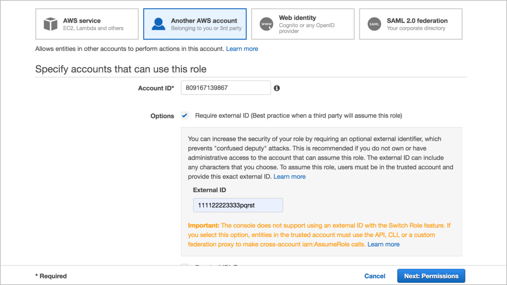
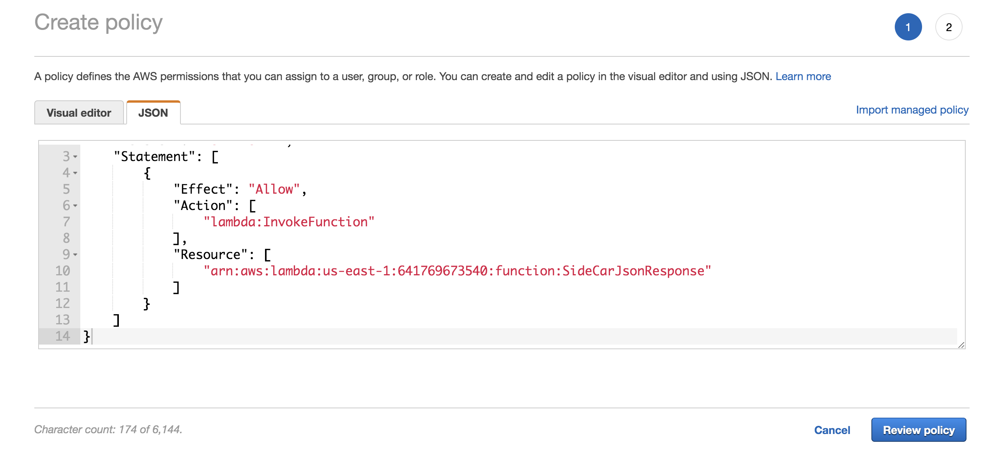

---
sidebar_position: 2
---

# Prerequisites for AWS Lambda Sidecar Connector

<head>
  <meta name="guidename" content="API Management"/>
  <meta name="context" content="GUID-7a76a5d8-962b-4a6a-996a-eec3c2d83f84"/>
</head>

## Trust Policy Configuration in AWS Lambda

Customers who plan to use AWS Lambda Sidecar Connector must ensure prerequisites are met accurately. The following guidelines are provided for configuring the AWS Account with role and trust policy that allows the API Management Sidecar Connector to invoke Lambda function hosted/deployed by a customer. 

:::note

These instructions are for reference, customer actual AWS environment settings may be slightly different. Wherever there is a API Management requirement to comply with exact name, it is called out in the guidelines below. 

:::

## Procedure

To configure trust policy for providing access to API Management, create a **cross account assume role** by following these steps: 

:::note

Assume role name should start with Boomi\_sidecar\_connector. 

:::

1. In the AWS Management console, click Identity and Access Management (IAM) > Access management > Roles > Create role. 

1. Click Another AWS account. Input the Account ID as 809167139867 and in the Options field input the External ID and click Next:Permissions. 

   External ID 

   External ID can be any string which should be mentioned in pre-input configurations. 

   :::note
   
   The Account ID must be 809167139867 since this is the API Management AWS Account ID that Sidecar Connector uses to create STS client to assume role. 

   :::

   

1. Provide permission to invoke AWS Lambda to this role. You can select an existing policy such as AWSLambdaFullAccess or you can create a new policy by selecting the Create Policy button. 

1. Define the custom policy in the Create policy > JSON tab. Provide access only to invoke Lambda function and click Review policy. 

   :::note
   
   Sample ARN is for reference only. Customer Lambda resource ARN may be different and specific to the customer's Lambda function. 

   :::



1. In the Review policy section, input the Name and Description and click Create policy. 

1. Select the new policy from the list of policies and click Next:Tags. 

   :::note
   
   If the created policy is not available in the list of policies, refresh the page. 

   :::

1. In the Add tags section, input the Key and Value for the tags that you wish to add. This is optional. Click Next:Review. 

1. In the Review section, input the Role name, Role description and then click Create role. 

   :::note
   
   The role name must start with tibco\_sidecar\_connector for proper functionality of this connector. 

   :::

1. The role name "tibco\_sidecar\_conector" will be created successfully. 

   **Tip**: Copy roleARN of this newly created role and provide it in pre-input configurations. 

## Sample Trust Policy for Assume Role

Following is a sample trust policy with Boomi AWS account ID 809167139867 and External ID 111122223333pqrst. 

```xml
{
"Version": "2012-10-17",
"Statement": [{
"Effect": "Allow",
"Principal": {
"AWS": "arn:aws:iam::809167139867:role/java_proxy"
},
"Action": "sts:AssumeRole",
"Condition": {
"StringEquals": {
"sts:ExternalId": "<external ID that customer sets for AWS Lambda function >"
}
}
}]
}
```

:::note

The is a stricter IAM policy that trusts and only allows calls only from Boomi AWS Identity having account ID 809167139867 with role java\_proxy. 

:::

## Sample Permission Policy for AWS Lambda Invocation

```xml
{
"Version": "2012-10-17",
"Statement": [{
"Effect": "Allow",
"Action": [
"lambda:InvokeFunction"
],
"Resource": [
arn:aws:lambda:us-east-1:641769673540:function:SideCarJsonResponse
]
}]
}
```

:::note

Customer Lambda resource ARN may be different and specific to the customer's Lambda function.

:::

## Assume Role Support In AWS Lambda SideCar Integration

- In order to comply with AWS shared responsibility model secure best practices, Sidecar Integration supports Assume Role functionality. 

- With Assume Role support available in the Connector, customer is not required to share AWS IAM basic credentials. Sidecar Connector assumes role for roleARN provided in pre-input configuration.

- Customer needs to set trust policy for role in AWS account and needs to define that roleARN in pre-input configuration. 

- Customer is required to set External ID in trust policy. External ID in trust policy is a part of AWS secure practices to mitigate risk of confused deputy attack. ([AWS documentation on confused deputy attack](https://docs.aws.amazon.com/IAM/latest/UserGuide/id_roles_create_for-user_externalid.html).) 

## Securing Customer ExternalID As Secret

- API Management stores External Id value in the AWS Systems Manager Parameter Store using key-value pair. Boomi CloudSecurity team recommendation is to treat externalID as a secret for AWS IAM accounts. 

  - This is one of the best and secure cloud practices to protect customers resources and mitigate the risk of unauthorized access to Lambda functions. 

  - Boomi CloudSecurity guidance has been that externalID value should be treated as a secret and should not be entered into pre-input configuration in plain-text. 

- Customer needs to share External ID key-value pair for provisioning in Boomi AWS Parameter Store infrastructure. 

  :::note
  
  Customer must define same External Id key in pre-input configuration for Sidecar Connector to work accurately.

  ::: 

- AWS recommends that the Parameter Store key should be defined in hierarchy. Customer should define external id in proper hierarchy. 

- The following guidelines should be complied between API Management and customer who plans to use AWS Lambda Sidecar Connector.

- Customer should follow hierarchy as `<Customer Name>/<Environment>/<Key Name>`. Why this format is designed? 

  - This format is designed to allow a unique namespace for each Boomi customer that use AWS Lambda Sidecar Connector.

  - It also provides customer a flexibility to manage externalID for their different environments which may be different. 

  - A recommended secure practice to keep secrets different for prod and non-prod environments. 

    - Prod Environment - `"acme/prod/<trustKey>"`, where trustKey indicates the parameter key name to store ExternalID value. 

    - Non-Prod Environment - `"acme/staging/<trustKey>"`, where trustKey indicates the parameter key name to store ExternalID value. 
