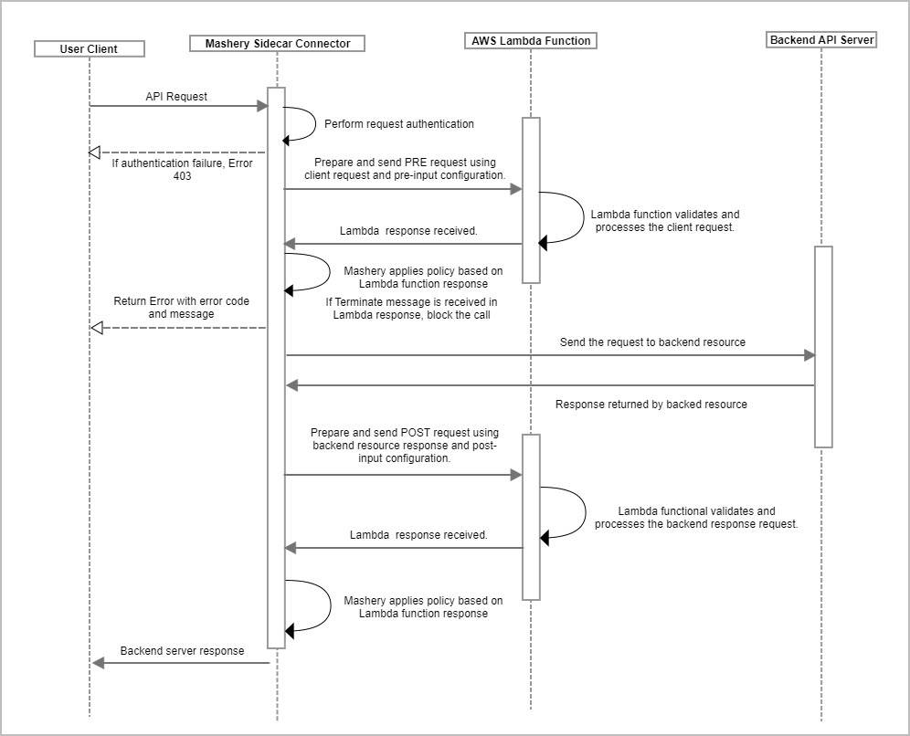
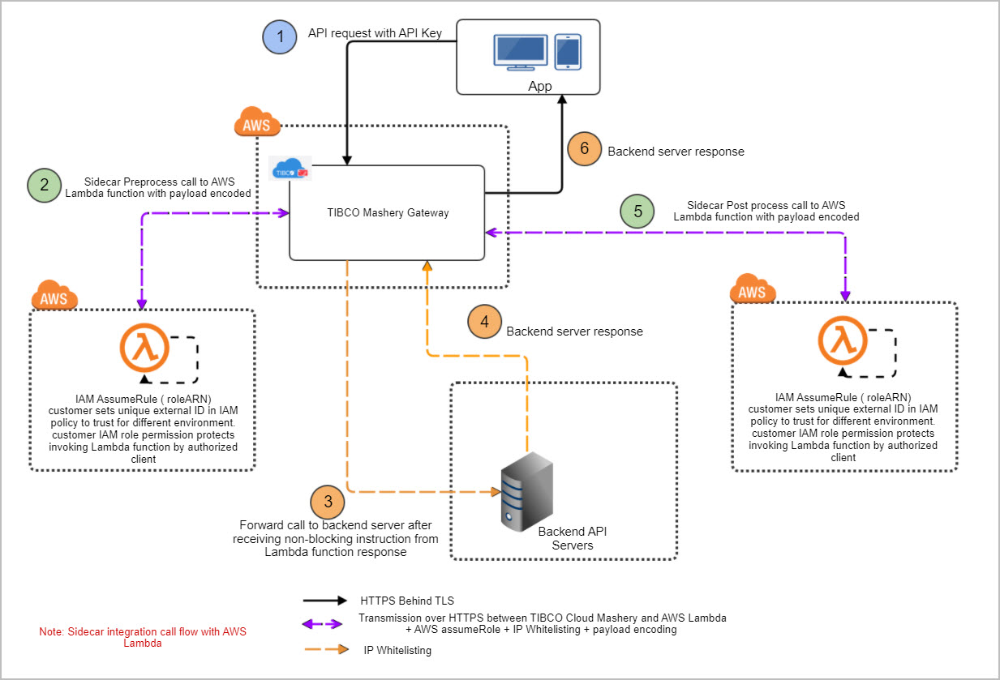

---
sidebar_position: 3
---

# Design and Implementation

<head>
  <meta name="guidename" content="API Management"/>
  <meta name="context" content="GUID-43cf486a-1659-459c-bb89-a3d7cc6dffab"/>
</head>

## Sidecar Connector Sequence Flow Diagram



## Sidecar Connector System Architecture Flow Diagram



## Sidecar Integration Error Handling

|**Error Name** |**Error Message** |**HTTP Status Code** |**Cause** |
| --- | --- | ---- | ------ |
|InvalidPreInputConfiguration |AWS Region Not Specified |500 |AWS region not specified in pre-input configuration |
|InvalidPreInputConfiguration |Function ARN Not Specified |500 |Function ARN not specified in pre-input configuration |
|InvalidPreInputConfiguration |Role ARN Not Specified |500 |Role ARN not specified in pre-input configuration |
|InvalidPreInputConfiguration |External ID Not Specified |500 |External ID not specified in pre-input configuration |
|InvalidPreInputConfiguration |Sidecar Connector timeout is greater than endpoint timeout |500 |Sum of timeout specified in pre and post input configuration is more than endpoint timeout. |
|RequiredHeaderConditionFailure |Required Header - `<Header Name> Unavailable` |400 |One of the require-request-headers defined in pre-input configuration is not present in the request sent to API Management. |
|RequiredHeaderConditionFailure |Header Information Unavailable |400 |Unable to fetch information about request headers sent to API Management|
|RequiredApplicationEAVConditionFailure |`Required Application EAV - <Application EAV Name> Unavailable` |400 |One of the require-eavs defined in pre-input configuration is not present in the request sent to API Management. EAV could be missing as it's not defined in Control Center for application through which request is sent to API Management. |
|RequiredApplicationEAVConditionFailure |Error occurred while fetching application data |400 |Unable to fetch information about Application EAVs |
|RequiredPackageKeyEAVConditionFailure |`Required Package Key EAV - <Package Key Name> Unavailable` |400 |One of the require-packageKey-eavs defined in pre-input configuration is not present in the request sent to API Management. EAV could be missing as its not defined in Control Center for package key through which request is sent to API Management. |
|RequiredPackageKeyEAVConditionFailure |Error occurred while fetching package key data |400 |Unable to fetch information about Package Key EAVs |
|MaxPayloadConditionFailure |Payload length is more than max allowed payload |413 |If max-payload-condition is defined as "blocking" and size of the payload which needs to be sent to AWS Lambda (either request payload or response payload) is greater than defined max-payload-size in pre-input configuration. |
|MaxPayloadConditionFailure |Payload length is more than 1MB. |413 |If size of the payload which needs to be sent to AWS Lambda (either request payload or response payload) is greater than 1MB. |
|InvalidJSONInputForAWSLambda |Error while creating json input for AWS Lambda in pre-process |400 |AWS Lambda Request which will be sent from API Management to AWS Lambda in pre-process is not created in proper JSON format. |
|InvalidJSONInputForAWSLambda |Error while creating json input for AWS Lambda in post-process |500 |AWS Lambda Request which will be sent from API Management to AWS Lambda in post-process is not created in proper json format. |
|InvalidResponseFromAWSLambdaInPreProcess |AWS Lambda Response is not returned |500 |Response is not returned from AWS Lambda function in pre-process. In case failSafe is defined as "true", even if response is not returned from AWS Lambda function, error will not be thrown. |
|InvalidResponseFromAWSLambdaInPostProcess |AWS Lambda Response is not returned |500 |Response is not returned from AWS Lambda function in post-process. In case failSafe is defined as "true", even if response is not returned from AWS Lambda function, error will not be thrown. |
|InvalidResponseFromAWSLambdaInPostProcess |Invalid output from AWS Lambda function |500 |Response returned from AWS Lambda in post-process is not in proper JSON format. |
|InvalidResponseFromAWSLambdaInPreProcess |Invalid output from AWS Lambda function |500 |Response returned from AWS Lambda in pre-process is not in proper JSON format. |
|InvalidResponseFromAWSLambdaInPreProcess |Success Response not returned from AWS Lambda |500 |AWS Lambda response status code is other than 200 and 202 in pre-process |
|InvalidResponseFromAWSLambdaInPreProcess |Error while connecting to AWS lambda. |500 |Exception occurred while connecting to AWS Lambda in pre-process |
|InvalidResponseFromAWSLambdaInPreProcess |`<Exception Message From AWS Lambda>` |500 |Amazon Service Exception occurred while connecting to AWS Lambda in pre-process. |
|InvalidResponseFromAWSLambdaInPostProcess |Success Response not returned from AWS Lambda |500 |AWS Lambda response status code is other than 200 and 202 in post-process |
|InvalidResponseFromAWSLambdaInPostProcess |Error while connecting to AWS lambda. |500 |Exception occurred while connecting to AWS Lambda in post-process |
|InvalidResponseFromAWSLambdaInPostProcess |`<Exception Message From AWS Lambda>` |500 |Amazon Service Exception occurred while connecting to AWS Lambda in post-process. |
|Gateway Timeout |Timeout occured while connecting to AWS Service |504 |Timeout occurred while connecting and retrieving response from Lambda function. |

## AWS Lambda Function Error Handling

Unlike Lambda Function invocation errors, function errors don't cause Lambda to return a 400-series or 500-series status code. 

If the function returns an error, Lambda indicates this by including a header named X-Amz-Function-Error, and a JSON-formatted response with the error message and other details. Make a note Lambda function runtime errors still comes with HTTP status code as 2xx. 

Lambda runtime errors are formatted like errors that implementor code returns, but they are returned by the runtime. In the following example, the Lambda runtime fails to deserialize the event into an object and responds with error message, cause and other details. 

```

{
"errorMessage": "An error occurred during JSON parsing",
"errorType": "java.lang.RuntimeException",
"stackTrace": [],
"cause": {
"errorMessage": "com.fasterxml.jackson.databind.exc.InvalidFormatException: Can not construct
instance of java.lang.Integer from String value '1000,10': not a valid Integer value\n at [Source:
lambdainternal.util.NativeMemoryAsInputStream@35fc6dc4; line: 1, column: 1] (through reference
chain: java.lang.Object[0])",
"errorType": "java.io.UncheckedIOException",
"stackTrace": [],
"cause": {
"errorMessage": "Can not construct instance of java.lang.Integer from String value '1000,10': not
a valid Integer value\n at [Source: lambdainternal.util.NativeMemoryAsInputStream@35fc6dc4;
line: 1, column: 1] (through reference chain: java.lang.Object[0])",
"errorType": "com.fasterxml.jackson.databind.exc.InvalidFormatException",
"stackTrace": [
"com.fasterxml.jackson.databind.exc.InvalidFormatException.from
(InvalidFormatException.java:55)",
"com.fasterxml.jackson.databind.DeserializationContext.weirdStringException
(DeserializationContext.java:907)",
...
]
}
}
}

```

In this case, Sidecar Connector rejects the call and respond to user client with an error message in the format described below. HTTP Status Code is set as 502 in case of function error from AWS Lambda and below message is set as HTTP Response Body. Below message format provides enough details to the user client for the cause but not the entire stack trace. This error response body design is closer in compliance to [RFC 7807: Problem Details for HTTP API](https://tools.ietf.org/html/rfc7807#page-3)s as well as AWS Lambda guidelines. 

```xml
{
"code": 502,
"message": {
"detail": "An error occurred during JSON parsing",
"title": "java.lang.RuntimeException"
}
}
```

