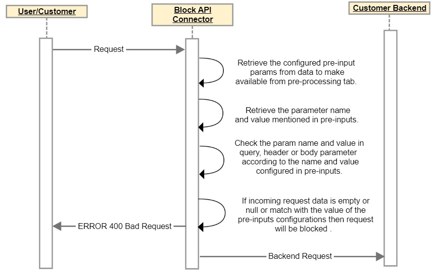
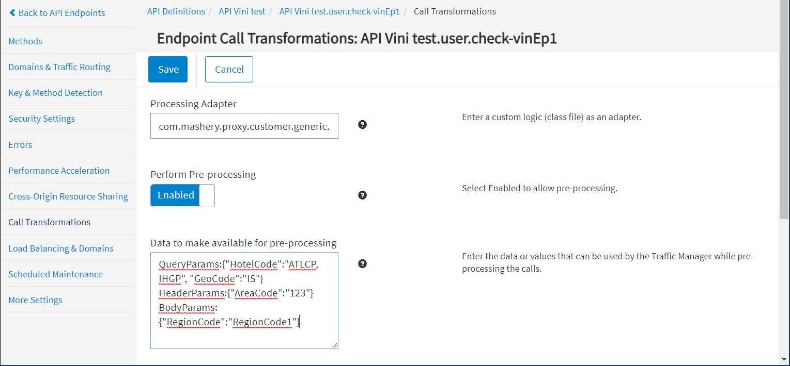

---
sidebar_position: 15
---

# Block API Connector

<head>
  <meta name="guidename" content="API Management"/>
  <meta name="context" content="GUID-71baa919-cf0b-4ef9-8ac0-a16f20ee7266"/>
</head>

## Description

- Connector blocks or filters incoming requests and does not allow the request going to the backend based on defined business rules. 

- Business rules check if the parameter value match is found in: query parameters, header parameters, or JSON body parameters; with the configured pre-inputs in the API Control Center dashboard. 

- Supports only pre-processing of API requests. 

## Usage

The following table lists the API filtering functional behavior based on parameter and its values from the coming API call. Parameters can be set in request query string, header and/or body. 

This is only for reference purposes. 

|**API Request** |**Parameter in Query String** |**Filtering Input Configurations** |**Filter Rule** |
| --- | --- | --- | --- |
|http://api.acmehotel.com/hotelavail?HotelCode=ATLCP&Start=2018-12-01&End=2018-12-05&RatePlanCode=&NonSmoking=false&AdultCount=2&Quantity=1&Format=xml&apikey=b7yhawkbqjvd47u26pqcqbxc|HotelCode:ATLCPRatePlanCode:null |HotelCode parameter not configured |Allow |
|http://api.acmehotel.com/hotelavail?HotelCode=&Start=2018-12-01&End=2018-12-05&RatePlanCode=&NonSmoking=false&AdultCount=2&Quantity=1&Format=xml&apikey=b7yhawkbqjvd47u26pqcqbxc|HotelCode:nullRatePlanCode:null|HotelCode parameter not configured |Allow |
|http://api.acmehotel.com/hotelavail?HotelCode=&Start=2018-12-01&End=2018-12-05&RatePlanCode=IGCOR&NonSmoking=false&AdultCount=2&Quantity=1&Format=xml&apikey=b7yhawkbqjvd47u26pqcqbxc|HotelCode:null RatePlanCode:IGCOR|HotelCode parameter not configured |Allow |
|http://api.acmehotel.com/hotelavail?HotelCode=ATLCP&Start=2018-12-01&End=2018-12-05&RatePlanCode=IGCOR&NonSmoking=false&AdultCount=2&Quantity=1&Format=xml&apikey=b7yhawkbqjvd47u26pqcqbxc|HotelCode:ATLCP |QueryParams:\{ HotelCode : ALTCP \}|Block |
|http://api.acmehotel.com/hotelavail?HotelCode=&Start=2018-12-01&End=2018-12-05&RatePlanCode=IGCOR&NonSmoking=false&AdultCount=2&Quantity=1&Format=xml&apikey=b7yhawkbqjvd47u26pqcqbxc|HotelCode:nullRatePlanCode:IGCOR |QueryParams:\{ HotelCode : ALTCP \}|Block |
|http://api.acmehotel.com/hotelavail?HotelCode=&Start=2018-12-01&End=2018-12-05&RatePlanCode=IGCOR&NonSmoking=false&AdultCount=2&Quantity=1&Format=xml&apikey=b7yhawkbqjvd47u26pqcqbxc|HotelCode:nullRatePlanCode:IGCOR|QueryParams:\{ HotelCode : \} |Block |
|http://api.acmehotel.com/hotelavail?HotelCode=XYZQR&Start=2018-12-01&End=2018-12-05&RatePlanCode=IGCOR&NonSmoking=false&AdultCount=2&Quantity=1&Format=xml&apikey=b7yhawkbqjvd47u26pqcqbxc|HotelCode:XYZQRRatePlanCode:IGCOR |QueryParams:\{ HotelCode : \} |Allow |
|http://api.acmehotel.com/hotelavail?HotelCode=ATLCP&Start=2018-12-01&End=2018-12-05&RatePlanCode=IGCOR&NonSmoking=false&AdultCount=2&Quantity=1&Format=xml&apikey=b7yhawkbqjvd47u26pqcqbxc|HotelCode:ALTCPRatePlanCode:IGCOR|QueryParams:\{ HotelCode : ALTCP \}|Block |
|http://api.acmehotel.com/hotelavail?HotelCode=PQRST&Start=2018-12-01&End=2018-12-05&RatePlanCode=IGCOR&NonSmoking=false&AdultCount=2&Quantity=1&Format=xml&apikey=b7yhawkbqjvd47u26pqcqbxc|HotelCode:PQRSTRatePlanCode:IGCOR|QueryParams:\{ HotelCode : ALTCP \}|Allow |
|http://api.acmehotel.com/hotelavail?HotelCode=PQRST&Start=2018-12-01&End=2018-12-05&RatePlanCode=IGCOR&NonSmoking=false&AdultCount=2&Quantity=1&Format=xml&apikey=b7yhawkbqjvd47u26pqcqbxc|HotelCode:PQRSTRatePlanCode:IGCOR|QueryParams:\{ HotelCode : ALTCP,PQRST \}|Block |
|http://api.acmehotel.com/hotelavail?HotelCode=PQRST&Start=2018-12-01&End=2018-12-05&RatePlanCode=IGCOR&NonSmoking=false&AdultCount=2&Quantity=1&Format=xml&apikey=b7yhawkbqjvd47u26pqcqbxc|HotelCode:PQRST RatePlanCode:IGCOR|QueryParams:\{ HotelCode : ALTCP,PQRST;RatePlanCode:IGCOR\}|Block |
|http://api.acmehotel.com/hotelavail?HotelCode=PQRST&Start=2018-12-01&End=2018-12-05&RatePlanCode=XYZCR&NonSmoking=false&AdultCount=2&Quantity=1&Format=xml&apikey=b7yhawkbqjvd47u26pqcqbxc|HotelCode:PQRSTRatePlanCode:XYZCR|QueryParams:\{ HotelCode : ALTCP,PQRST;RatePlanCode:IGCOR\}|Block |
|http://api.acmehotel.com/hotelavail?HotelCode=PQRST&Start=2018-12-01&End=2018-12-05&RatePlanCode=&NonSmoking=false&AdultCount=2&Quantity=1&Format=xml&apikey=b7yhawkbqjvd47u26pqcqbxc|HotelCode:PQRSTRatePlanCode:null|QueryParams:\{ HotelCode : ALTCP,PQRST;RatePlanCode:\}|Block |
|http://api.acmehotel.com/hotelavail?HotelCode=PQRST&Start=2018-12-01&End=2018-12-05&RatePlanCode=&NonSmoking=false&AdultCount=2&Quantity=1&Format=xml&apikey=b7yhawkbqjvd47u26pqcqbxc|HotelCode:PQRSTRatePlanCode:null|QueryParams:\{ HotelCode : ALTCP,PQRST;RatePlanCode: XYZPQ\}|Block |
|http://api.acmehotel.com/hotelavail?Start=2018-12-01&End=2018-12-05&RatePlanCode=&NonSmoking=false&AdultCount=2&Quantity=1&Format=xml&apikey=b7yhawkbqjvd47u2|HotelCode: Not coming in request |QueryParams:\{ HotelCode : ALTCP,PQRST\}|Allow |

## Design and Implementation

**Sequence Diagram**



**Implementation Details** 

- Connector retrieves the parameter from the API Control Center pre-inputs configuration. 
- Connector checks for which part of the request needs to be checked: query param, header param or body param. 
- Accordingly, Connector retrieves the key value/values pair with respect to the query param, header param or body param. 
- Connector verifies whether the incoming request contains these key value pairs or not. 
- If request contains any of the specified key-value pairs, then the request will be blocked and an error is thrown; otherwise the request will be redirected to the backend. 
- For multiple key value pairs configured in query param, the Connector checks all key value pairs configured in pre-inputs with the incoming request. If no match found, the Connector allows the request to the backend; otherwise, the Connector blocks the call. 

**Business Rules**

- QueryParams is for query parameter, HeaderParams is for incoming request headers and BodyParams is for body parameter, adapter will check the param name and value in the incoming request. 
- If parameter value is empty, then request is blocked for the backend. 
- If parameter name and value is not empty/null but name/value is matched with the pre-inputs configuration, then request is blocked for the backend. 
- Param name and value are case-sensitive checked except header name; it means that request will be blocked for the backend only if parameters specified in the request is case-sensitive match with pre-input configurations. 
- As per rfc 7230, header name check will be case-insensitive. Only header name check will be case-insensitive, header value check is case-sensitive. 
- Duplicate param names are not allowed in any of the pre-inputs param. 
- If duplicate names are configured, then the order of precedence is `QueryParam > HeaderParam > BodyParam`: 
  - Query param gets checked. 

    If the incoming query param matches with the value of pre-input query param value, then the request is blocked. 

  - Otherwise, if the query param does not match, then header param is checked. 

    If the incoming header param matches with the value of pre-input header param, then the request is blocked. 

  - Otherwise, if the header param does not match, then the body param is checked. 

    If the incoming body param matches with the value of pre-input body param, then the request is blocked. 

  - Otherwise, Connector allows the request go to the backend. 

For example: 

```
QueryParams:{"HotelCode":"ATLCP,MIAMB,PMEGQ,STCMN,XSRSP,KNTMD,KLMVA,ORBAL,PNSPB,YGUON,GLCUK"}

HeaderParams:{"HotelCode":"ATLCP,MIAMB,PMEGQ,STCMN,XSRSP,KNTMD,KLMVA,ORBAL,PNSPB,YGUON,GLCUK,XYZ"}

BodyParams:{"HotelCode":"ATLCP,MIAMB,PMEGQ,STCMN,XSRSP,KNTMD,KLMVA,ORBAL,PNSPB,YGUON,GLCUK,PQR"}
```

In this case, QueryParams is given priority. If QueryParams is not mentioned, only BodyParams and HeaderParams, then HeaderParams will be given the priority. The least priority will be the BodyParams. 

- Sequence of pre-input config params should be maintained: 

  ```
  QueryParams:{"value":"value,value"}

  HeaderParams:{"value":"value,value"}

  BodyParams:{"value":"value,value"}
  ```

- If multiple params are configured, then Connector checks all the param names and values with the incoming request. If a match is found with any one of the param name and value, then the request will be blocked for the backend. 
- OR operation will be checked and performed between the params. 

  For example, if pre-input configuration is: 

  ```
  QueryParams:{"HotelCode":"ATLCP,MIAMB", "GeoCode":"IS,NY,TX"}

  HeaderParams:{AreaCode:"123,456,789"}
  ```

  So in this case, adapter will check HotelCode or GeoCode in the query parameter of incoming request or AreaCode header in request headers with the values configured in pre-inputs. If any one of the parameters matches with the pre-input configured values, then the request is blocked for the backend. 

- Body param is expected to come in valid JSON format. JSON body could be simple or complex. Example for JSON Body: 

  ```
  {"id": 1,"name": {"first": "Yong","last": "Mook Kim"},"HotelCode": "PQRS"}
  ```
## Assumptions

- In case BodyParams are configured and incoming JSON in the request is not in the valid format, in that scenario request is blocked and not be sent to the client. Example - Pre-Input Configurations: 

  ```
  BodyParams:{"HotelCode":"ATLCP,MIAMB,PMEGQ"}
  Request Json Body - {"HotelCode": "PQRST
  ```

  :::note
  
  In this scenario, request is blocked as incoming JSON body is not valid JSON. 

  :::

- In the pre-input configurations, specified values for QueryParams, HeaderParams and BodyParams should be in valid JSON format. In case specified values are not in valid JSON format, those values are read as key-value pairs. If those values are not converted into key-value pairs successfully, in that scenario, no request is blocked to the backend. 

  Example valid JSON Format: 

  ``````
  QueryParams:{"HotelCode":"ATLCP,MIAMB", "GeoCode":"IS,NY,TX"}
  ``````

  Invalid JSON but valid Key-Value Pair: 

  ```
  QueryParams:{"HotelCode":"ATLCP","002","param2":"val1"}
  ```

  :::note
  
  In the specified configuration, two valid key-value pairs are present ("HotelCode":"ATLCP" and "param2":"val1"). Invalid key-value pair ("002") is ignored. 

  :::

  Invalid JSON and invalid Key-Value Pair: 

  ```
  QueryParams:{"HotelCode"

  ="ATLCP","param2"="val1"}
  ```

- Block API Connector supports only JSON body. Content-Type for request body should be application/json. 

## Configuring Endpoint Processing

To configure Block API call processing for an endpoint: 

1. From the **API Management Control Center** dashboard, navigate to **Design > API Definitions**, then click the desired API definition from the list. 

2. Click an existing endpoint on the **Endpoints** page. 

3. Click **Call Transformations** in the left-hand menu. 

4. On the **Call Transformations** page, specify the following information in these fields: 

   a. **Processing Adapter:** com.mashery.proxy.customer.generic.blockApiConnector

   b. **Perform Pre-Processing:** Enabled 

   c. Data to make available for pre-processing: (one per line) 

      |**Data** |**Example** |**Notes** |
      | ----- | ---- | --- |
      |`QueryParams:{"ParamName1":"Value1,Value2,......", "ParamName2":"Value1,Value2,.......", ...........}` |`QueryParams:{"HotelCode":"ATLCP, IHGP", "GeoCode":"IS"}` |Optional |
      |`HeaderParams:{"ParamName3":"Value1,Value2,......", "ParamName4":"Value1,Value2,.......", ...........}` |`HeaderParams:{"AreaCode":"123"}` |Optional |
      |`BodyParams:{"ParamName5":"Value1,Value2,......", "ParamName6":"Value1,Value2,.......", ...........}` |`BodyParams:{"RegionCode":"RegionCode1"}`|Optional |



5. Click **Save** when done.

## Chaining

- Block API Connector can be chained with other Boomi Cloud API Management connectors, as well as Boomi Cloud API Management adapters developed as processors. 

- More details on how to chain two processors are provided in [Chaining Processors](../ChainingProcessorsorConnectors/Overview.md)

## Local Edition Porting

Block API Connector can be ported to Local Edition customer specific bundle. 

:::note 

Porting of this Connector can be performed by API Management for a specific Local Edition customer. For more information, consult API Management Customer Success team. 

:::