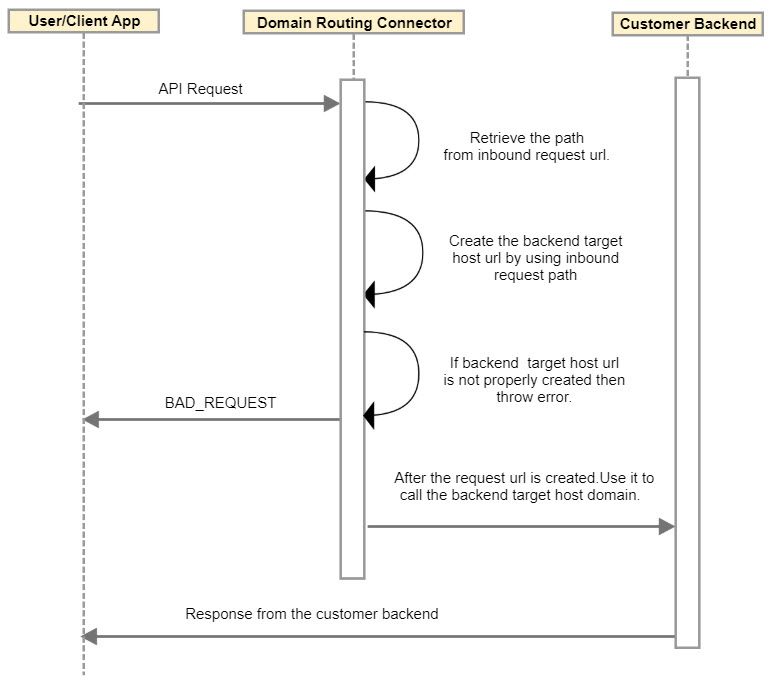

---
sidebar_position: 3
---

# Design and Implementation

<head>
  <meta name="guidename" content="API Management"/>
  <meta name="context" content="GUID-608ff051-a7a1-4aef-b8dc-6cc8ecc02f33"/>
</head>

## Sequence Diagram

## Implementation Details

- The Connector creates target endpoint address based on the incoming request path matched pattern value and the endpoint address pattern configured in pre inputs. 

- It retrieves the public endpoint address, for example https://api.acme.com/{id}/v1/, to know the exact location of domain name through {id} in order to retrieve the request path (domain name) from the incoming request url. 
- Connector fetches the pattern (target domain) value from the pre-inputs configuration, for example `www.{id}.com/v1/` or https://{url}/tve/v2/ where `{id}` or `{url}` is replaced by the incoming request path domain or URI value respectively. 

- Creates target endpoint address by using request path(domain name) and pattern (target domain) value from the pre-inputs then call is routed to the transformed endpoint address.

- If the incoming request url does not contain path to match the public endpoint path pattern or pre-inputs data is not configured, then the Connector routes the call to the API Management Control Center configured target endpoint. 

## Business Rules Assumptions

- Different request paths should have different endpoint configurations with the pre-inputs configured in preprocessing with particular pattern(target domain) for that endpoint. 

- Only one target endpoint should be configured in 'address' pre-input parameter. 

- The request path pattern can contain any identifier under `'{xxx}'` where `'xxx'` can be any identifier, for example: `'{pattern}'`, `'{brand}'`, `'{id}'`, etc. However, the identifier must match the pattern configured under pre-inputs.

  - **Sample 1** (The pattern configured under pre-inputs is replaced by the value coming in target request path against {brand}) 

    - request path -> `/{brand}/test/v2`

    - pre-inputs -> `address:www.{brand}.com/v1/`

    - Transformed endpoint address -> `www.{brand}.com/v1/`

  - **Sample 2** (The pattern configured under pre-inputs is replaced by the value coming in target request path against {url}) 

    - request path -> `/{url}/test/v3`

    - pre-inputs -> `address:{url}/v1/`

    - Transformed endpoint address → `{url}/v1/`

  - **Sample 3** (The pattern configured under pre-inputs is replaced by the value coming in target request path against {brand}, because it doesn't match) 

    - request path - /{brand}/test/v4

    - pre-inputs - address:www.{id}.com/v1/

    - No transformation of the target endpoint. 

- Only single identifier pattern is allowed under request path, for example "/{brand}/test" and not "/{brand}/test/{id}". 

- URI configured in pre-input, should contain 'protocol' as well as request path. 

- If URI is configured without protocol in pre-inputs, then the default protocol is used as 'http'. 

- There is no way to find out the valid/invalid host, hence whatever is configured in pre-inputs is used for transformed routing (after replacing identifier field). 

- When address in pre-input is empty, then request hits the target endpoint address configured in API Management Control Center.

- When pre-input data is not configured, then also request routes to the target endpoint address configured in API Management Control Center.

- If multiple identifier patterns are configured in pre-input configuration in the 'address' parameter, the routing transformation fails and the request is sent to the API Management Control Center configured target endpoint address. 
