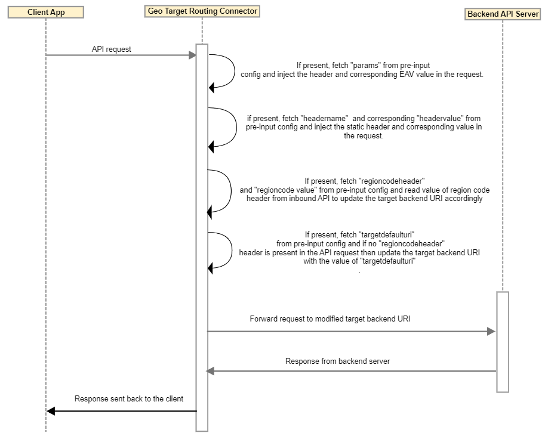

---
sidebar_position: 3
---

# Design and Implementation

<head>
  <meta name="guidename" content="API Management"/>
  <meta name="context" content="GUID-ab4f315e-177b-47ed-8d41-79838a5c92d1"/>
</head>

## Sequence Diagram

## Implementation

- Connector routes incoming API request based on call origination region that is passed in an HTTP header. 

- The connector can optionally inject an HTTP header.

- Connector fetches pre inputs from the configuration, then inject HTTP Header with name as configured in pre inputs. 

- For example 'params' allows configuring key and value pair for optional header values. Key values can be based on an EAV stored in the Package Key level and Service Key level model as well as standard fields of package\_keys, packages, keys, and plans model.

  - Syntax :`- params:{<HeaderName>:package\_keys.<EavName>, ...}`

  - Example :`- params:{"X-Platform-Id":"package\_keys.platform\_id","pref\_uri":"package\_keys.pref\_uri"}` 

- Target URI can be configurable and value can be based on an inbound header as well as model EAV configured by the admin in the data to make available for pre-processing. 

- Connector sets the target hostname according to the following priorities, first according to the inbound region code header if not available then target default URI. 

## Business Rules and Assumptions

- If the value of the EAV is empty or null, then no header gets injected. This also applies when no EAV can be found or a null value is returned. 

- If the header name or value is empty or null then no header is injected. 

- If no region code can be found and the **pref\_uri** is not configured in EAV, Connector uses **targetdefaulturi** value configured to route the traffic. 

- No errors are triggered by the Connector if any optional parameters are not specified. 
