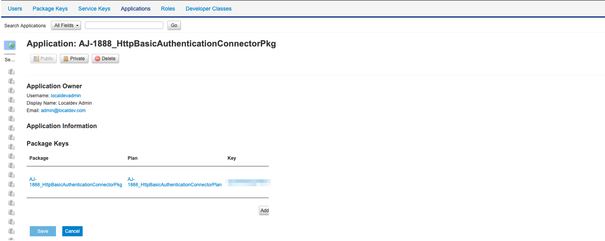
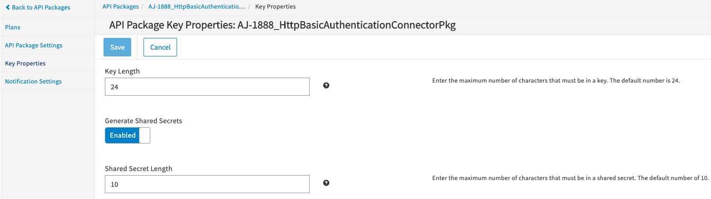
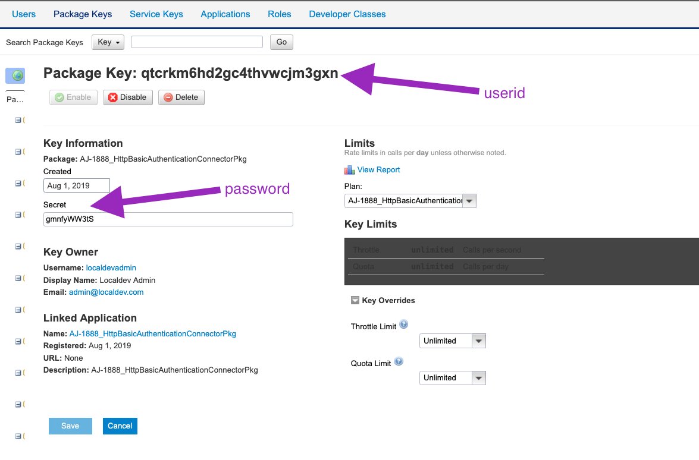

---
sidebar_position: 5
---

# Configuring Endpoint Call Processing as an Authenticator

<head>
  <meta name="guidename" content="API Management"/>
  <meta name="context" content="GUID-1d6bd309-e448-478a-ae61-1cacd73a84cd"/>
</head>

:::note

This procedure will be deprecated in Q4 2020. 

:::

## How to Configure Basic Credentials in API Management Control Center

The Client Application which is making API call should have an associated custom package key created. The Package key whose ID matches the user ID from the decoded request header and the password matches the package key's secret. 

Key Properties under Package

1. Enable Generated Shared Secrets 
1. Provide Shared Secret Length. Default length is 10. Maximum length can be 64 characters.

The following is a sample custom package key that holds secret as password and package key name as userid.

**Key and Method Detection tab**

On the **Key and Method Detection** page, specify the following information in these fields: 

- **Request Authentication Type:** Custom

- **Developer's API Key Location:** Custom

- **Custom Request Authentication Adapter:** com.mashery.proxy.customer.generic.http-basic-auth

