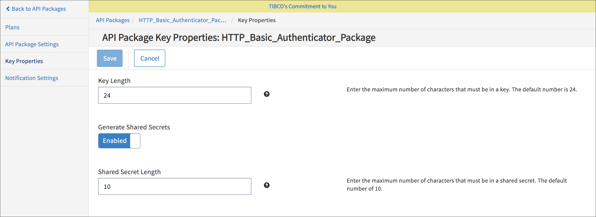
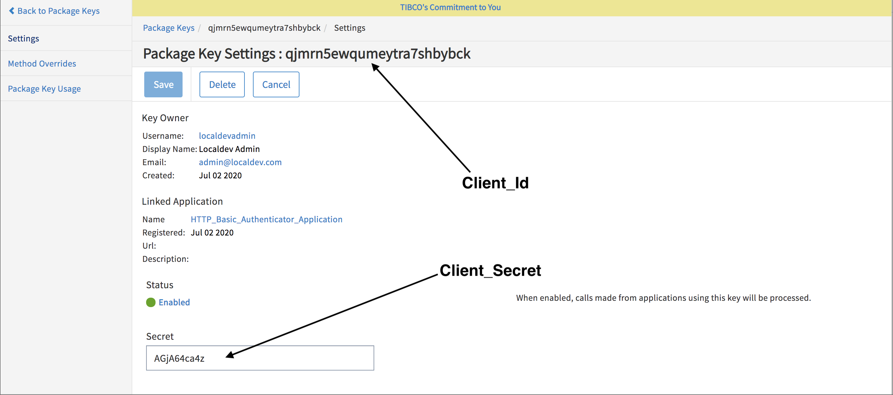
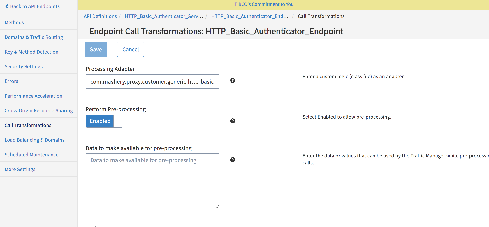

---
sidebar_position: 4
---

# Configuring Endpoint Call Processing as a Processor

<head>
  <meta name="guidename" content="API Management"/>
  <meta name="context" content="GUID-99f11af5-fe40-4e0a-acbd-93616b818e77"/>
</head>

:::note

- Configuring the Connector as processor overrides the default behavior of API Management Proxy server response with 403 code when Authorization header is not present in the request or credentials are not present in this header with Basic scheme in API request.

- This is the recommended approach considering this default behavior is closer to RFC guidelines to respond with 401 code when Authorization header is not present in the request or credentials are not present in this header with Basic scheme in API request. 

:::

## How to Configure Basic Credentials in API Management Control Center

Client application which is making API call should have an associated custom package key created. Package key whose ID matches the user ID from the decoded request header and the password matches the package key's secret.

## Key Properties under Package

- Enable Generated Shared Secrets 

- Provide Shared Secret Length. Default length is 10. Maximum length can be 64 characters. 

Here is one sample custom package key that holds secret as password and package key name as userid. 

## Under Call Transformation Tab

- **Processing Adapter:** com.mashery.proxy.customer.generic.http-basic-auth 

- **Perform Pre-Processing:** Enabled 

- **Data to make available for pre-processing:** as shown in the following table: 

  |**Pre-Input Data** |**Example** |**Notes** |
  | ----- | ---- | ---- |
  |`Keep\_Mashery\_Default\_Response\_Code : <true/false>`|`Keep\_Mashery\_Default\_Response\_Code:true`|
Optional parameter, Default value: false

This check is case insensitive. Example of valid values - true, TRUE, True, true, etc. 

In case this parameter is not specified or specified as empty or any other string other than case insensitive boolean true, then its value will be considered as false. 

For backward compatibility if any customer expects API Management platform default behavior to return 403 response if Authorization header is not present in the request or credentials are not present in this header with Basic scheme, then `Keep\_Mashery\_Default\_Response\_Code` pre-input parameter can be configured as "true". 
|

