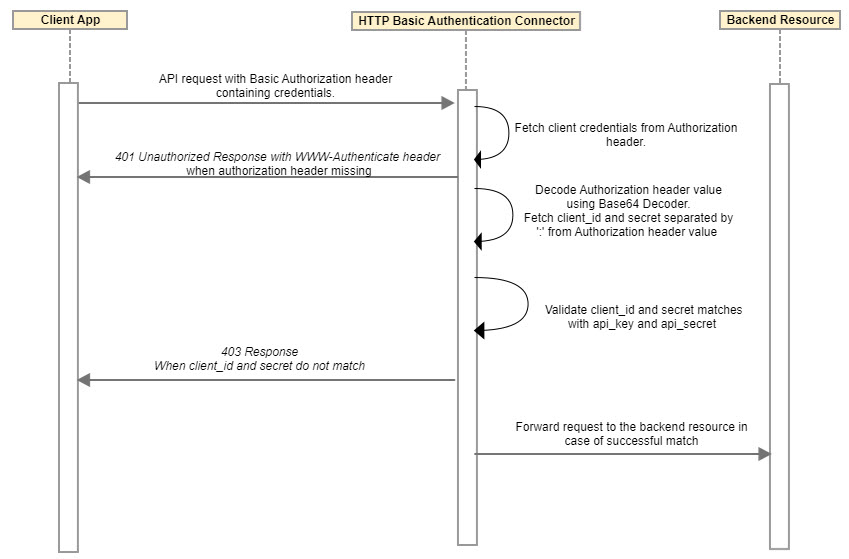

---
sidebar_position: 3
---

# Design and Implementation

<head>
  <meta name="guidename" content="API Management"/>
  <meta name="context" content="GUID-8bda8902-b969-4439-aa55-c26017ce2d19"/>
</head>

## Sequence Diagram

## Implementation Details

**HTTP Basic Auth Flow**

1. Connector retrieves "Authorization" header from the request.

1. In case **Authorization** header is not present in the request or credentials are not present in this header with Basic scheme, then connector retrieves pre-input boolean parameter Keep\_Mashery\_Default\_Response\_Code. 

1. If Keep\_Mashery\_Default\_Response\_Code is configured as true, then Connector responds with 403 response code to user client; otherwise responds with 401 Unauthorized along with WWW-Authenticate header to the user client. 

1. Connector then retrieves client credentials from Authorization header value which is present after "Basic" scheme. 

1. Connector decodes client credentials using Base64 decoder and separates client\_id and client\_secret by ":". 

1. The client\_id credentials is usually API Management package key. The Connector retrieves app developer information using client\_id. 

1. In case app developer information is not retrieved using client\_id, then Connector responds with 403 response to the user client. 

1. In case Connector retrieves app developer information using client\_id successfully, then Connector retrieves api\_secret for that app developer. 

1. If Connector finds api\_secret for the app developer, then connector retrieves client\_secret from Authorization header decoded value and matches with api\_secret. 

1. If client\_secret is not present in Authorization header decoded value or does not match with api\_secret, then Connector responds with 403 to the user client. 

1. If client\_secret from Authorization header decoded value and api\_secret of app developer matches successfully, then Connector sends the request to the client resource along with HTTP Authorization header. 

## Business Rules and Assumptions

- The Connector does not support encrypted API secret if High Security Secret Management (HSSM) support is enabled in API Management. Refer to [Generating Package Key Secrets](https://docs.mashery.com/manage/GUID-FDDFF961-465B-4E32-8B7C-8F7DE264A50A.html). 

- The Connector default behavior is that if Authorization header is not present in the request or credentials are not present in this header with Basic scheme, then 401 Unauthorized response is returned. This behavior is compliant to RFC guidelines. 

- For backward compatibility if any customer expects API Management platform default behavior to return 403 response if Authorization header is not present in the request or credentials are not present in this header with Basic scheme, then Keep\_Mashery\_Default\_Response\_Code pre-input parameter can be configured as "true". 

- Caution: The Connector should not configured both as Authenticator and as Processor. 
