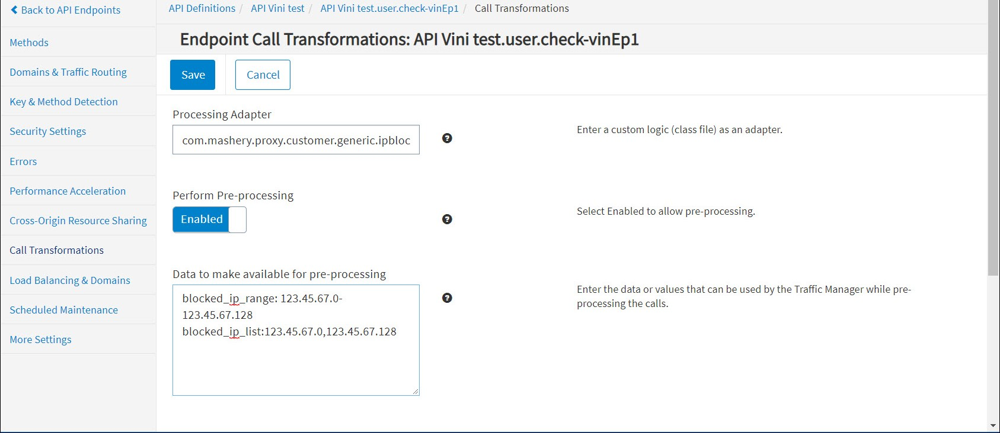

---
sidebar_position: 4
---

# Configuring Endpoint Call Processing

<head>
  <meta name="guidename" content="API Management"/>
  <meta name="context" content="GUID-ded2bb11-df9b-4eb2-95fc-58048beede27"/>
</head>

## Using the Connector as a Processor

To configure IP Blocking processing for an endpoint: 

1. From the **API Management Control Center** dashboard, navigate to **Design > API Definitions**, then click the desired API definition from the list. 

2. Click an existing endpoint on the **Endpoints** page. 

3. Click **Call Transformations** in the left-hand menu. 

3. On the **Call Transformations** page, specify the following information in these fields: 

   - **Processing Adapter:** com.mashery.proxy.customer.generic.ipblocker-processor

   - **Perform Pre-Processing:** Enabled 

   - Data to make available for pre-processing: (one per line) 

      |**Data** |**Example** |**Notes** |
      | ---- | ----- | ----- |
      |`blocked_ip_range: <n.n.n.0-n.n.n.128>` |`blocked_ip_range: 123.45.67.0-123.45.67.128`|Optional. |
      |`blocked_ip_list: <n.n.n.0,n.n.n.128>` |`blocked_ip_list: 123.45.67.0,123.45.67.128` |Optional. |
      |`keep_client_ip_as_source: <true or false>`|`keep_client_ip_as_source: false`|
Optional. 

When set to 'true', this flag overrides default behavior to select IP addresses of intermediaries, such as the proxy server that is closest to the API Management stack. 
|

5. Click **Save** when done. 
