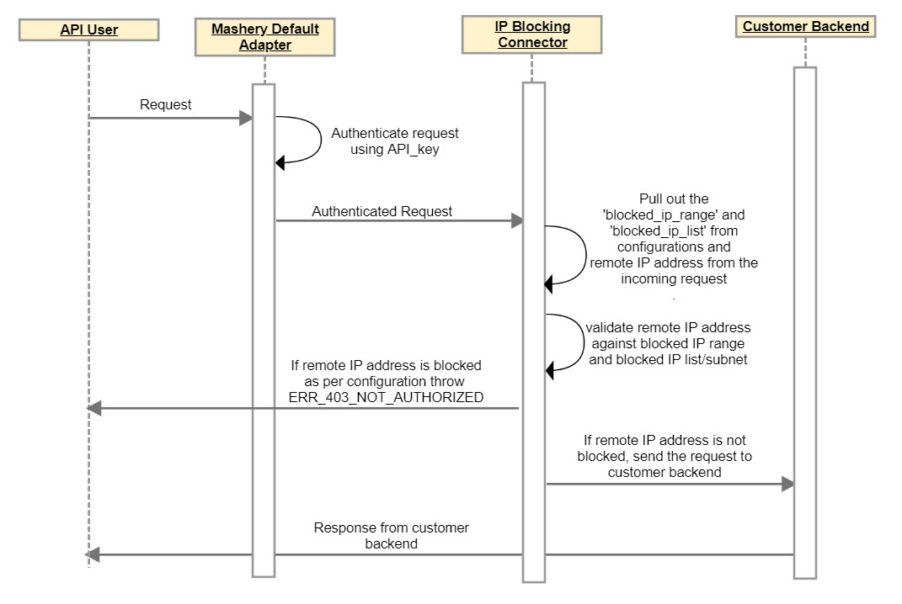

---
sidebar_position: 3
---

# Design and Implementation

<head>
  <meta name="guidename" content="API Management"/>
  <meta name="context" content="GUID-937bad22-15f7-4fbb-96cd-0a423b15e881"/>
</head>

## Sequence Diagram

## Implementation Details

- The Connector fetches the blocked\_ip\_range and blocked\_ip\_list from the pre-input configurations and the remote IP address from the incoming request. 

- It first validates the remote IP address against blocked IP ranges, based on the pre-input configurations. 

- If the remote IP address is specified in the blocked\_ip\_range, the connector displays a 403 error. The connector then validates the remote IP address against the blocked IP/subnet list. 

- If the remote IP address is present in the blocked\_ip\_list, then the connector displays a 403, not authorized (ERR\_403\_NOT\_AUTHORIZED) error, otherwise the API request is proxied to the backend server. 
