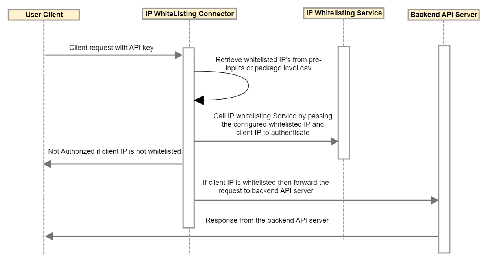

---
sidebar_position: 3
---

# Design and Implementation

<head>
  <meta name="guidename" content="API Management"/>
  <meta name="context" content="GUID-385dbe9b-425d-4653-8af5-364af5ddd148"/>
</head>

## Sequence Diagram

## Implementation Details

- If the connector is used as an Authenticator, the Whitelist IP Range and Whitelist IP list are retrieved either from service key or package key EAVs.

- If the connector is used as a Processor, Whitelist IP Range and Whitelist IP list are retrieved from pre-inputs.

- The requesting IP and retrieved Whitelist IP List/Range are passed to the IP Whitelisting Service to check whether the requesting IP exists in the Whitelisted IP list/Range. 

- If the requesting IP exists in the list/range, a request is sent to the backend. 

- If the requesting IP is not authenticated, then a Not Authorized error is sent back to the user client. 

## When to use Connector as an Authenticator vs. Processor

The Connector can be used as an Authenticator to augment API key with IP whitelisting. The Connector can also be used as a processor. A natural question comes into mind when to use this Connector as an Authenticator vs Processor. Here are few tips about business cases that might benefit from this Connector. 

**Use as an Authenticator**

- When you need to bind IP whitelisting policy to a specific Package key or API key.

- API Management allows you to configure Package key level EAV (Custom Attribute Value) that binds to a particular package key. Refer [Using the Connector as an Authenticator](Configuring_endpoint_call_processing_15.md).

**Use as a Processor** 

- When you need to apply IP whitelisting policy to all traffic that goes through service endpoint. Refer [Using the Connector as a Processor](Configuring_endpoint_call_processing_15.md).

