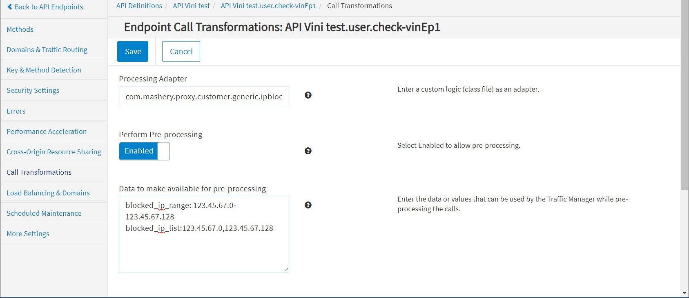

# IP Routing Connector

<head>
  <meta name="guidename" content="API Management"/>
  <meta name="context" content="GUID-eb5ccdb8-9f90-4c19-b146-68e18b57712d"/>
</head>

## Description

The connector filters API requests originating from a set of IPs reaching the configured backend target. It supports IPs in the following formats: 

- CIDR (for example - a.b.c.d/x) 

- IP (a.b.c.d) 

Only supports pre-processing of the API request. 

## Usage

Following are examples of the request routing according to the subnet or IP for the pre-processing configuration: 

- Routing by subnet: `123.45.0.0/16:targethost-us.example.com`

- Routing by IP: `123.45.67.0:targethost-eu.example.com`

## Design and Implementation

**Implementation Details**

- The connector retrieves pre-inputs from the service configuration. The pre-input map maps the host name to the IPs. 

- If configured pre-inputs contain CIDR-format IPs, then the look-up is done against CIDR-format IPs. 

- The connector calls the IP Routing Service by passing the configured host name map to look up and replace the target host. 

- IP Routing Service checks whether the request contains an X-Forwarded-For header. If this header is not present in the request, the request is not routed. 

- If the request contains X-Forwarded-For, then the host name is retrieved from the pre-input map using the X-Forwarded-For value. 

- The target host is replaced by host configured in the pre-input configuration, and the request is sent to the customer backend. If that customer backend host is down or invalid, the request will fail. 

- No IP-based routing will occur if the IP is not configured in the pre-inputs. 

## Configuring Endpoint Call Processing

To configure IP routing call processing for an endpoint: 

1. From the API Management Control Center dashboard, navigate to Design > API Definitions, then click the desired API definition from the list. 

1. Click an existing endpoint on the Endpoints page. 

1. Click Call Transformations in the left-hand menu.

1. On the Call Transformations page, specify the following information in these fields: 

   1. **Processing Adapter:** `com.mashery.proxy.customer.generic.iprouter.processor`

   1. **Perform Pre-Processing:** Enabled 

   1. **Data to make available for pre-processing:** (one per line) 

      |**Data** |**Example** |**Notes** |
      | ---- | ---- | ----- |
      |`QueryParams:{"IPRouter1":"Value", "IPRouter2":"Value"}` |`hostname\_map:{"123.456.7.8":"api-target-eu.stats.com","12.34.5.6/22":"api-target-us.stats.com"}` |Optional |

1. Click **Save** when done.

## Chaining

IP Routing Connector can be chained with other Boomi Cloud API Management connectors, as well as Boomi Cloud API Management adapters developed as processors. 

For more information on how to chain two processors, see [Chaining Processors](../../ChainingProcessorsorConnectors/Overview.md).

## Porting

IP Routing Connector can be ported to the Local Edition customer-specific bundle.

:::note

Porting of this Connector can be performed by API Management for a specific Local Edition customer. For more information, consult API Management Customer Success team.

:::