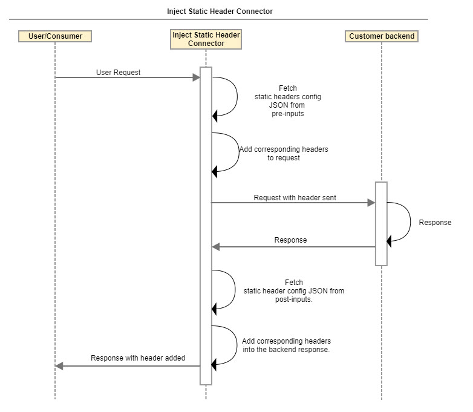

---
sidebar_position: 3
---

# Design and Implementation

<head>
  <meta name="guidename" content="API Management"/>
  <meta name="context" content="GUID-7212968b-5545-43ed-ba1a-3010b4924522"/>
</head>

## JSON Parsing

Parse the input JSON configuration using one of the following methods: 

- Using a JSON parser, such as Jackson ObjectMapper and JsonParser.  

- Using a combination of regex and string manipulation. 

Using a parser such as Jackson ObjectMapper is preferable since it also performs JSON validation and converts the string JSON to JsonNode, from which you can use String operations to get the header name, value and any associated conditions. 

## Sequence Diagram

## Implementation Details

- The connector is flexible, and addresses many of the [OWASP recommended secure header practices](https://owasp.org/www-project-secure-headers/#tab=Headers) apart from X-Content-Type-Options: nosniff.

- The connector extends the processor and override the preProcess() and postProcess() methods.

- **Pre Process**: 

  - The preProcess() fetches the pre-inputs map and gets the input JSON from it. 

  - The processor parses this JSON and gets the headers along with their values.

  - The processor adds all these headers to the incoming targetRequest and forwards it. 

- **Post Process**: 

  - The postProcess() method fetches the post-inputs map and gets the header JSON from it. 

  - The processor parses this JSON and gets the headers and values along with the HTTP status code element associated with it. 

  - If no status code element is present, the header and its value is added to the targetResponse. 

  - If the header has status codes associated with it, the connector checks the status code of the targetResponse. 

  - If the response status code matches one of the comma separated status codes associated with the header, it adds that header and value to the targetResponse.

  - If the response status code in configuration is specified as an HTTP status range (for example, "2xx"), then the header is added in the response for any successful response. 

  - The response is then returned. 

:::note

The status code range is not case sensitive and can be specified in "XXX" or "xxx" or "XxX" format. 

:::

## Business Need and Context

The following capabilities can be added to all endpoints. 

- Send the following Cache-Control headers back to the browser for a specified endpoint, to avoid caching by the browser: 

  - Cache-Control: private

  - Cache-Control: no-cache

  - Cache-Control: no-store

- Add header X-Content-Type-Options as "nosniff" to prevent a change of the content-type header. This is applicable for a 500 Status Code. 

  - If API Management receives a status code of 500 Status Code while connecting to an outbound URL, API Management (as a gateway) can add "X-Content-Type-Options:nosniff" to prevent cross-site scripting. 

## Assumptions

- The input (pre-input and post-input configuration) is provided as a valid JSON as shown in the sample JSON input.

- The validity of the headers and their values is not within the scope of this connector. The header is added as long as it is in the proper format. 

- The header and value needs to be in the key:value (colon separated) pair format. Anything after the first colon ( : ) is considered the header value. 

- If there is no colon in the header, it is skipped. If a colon appears at the end, the header is added with an empty value. 

- If the same header name and value pair is specified multiple times in the configuration, it is added only once in the request/response. 

- During pre-processing, if any other condition is present with a header, it is ignored, and the header is added in the request. 
