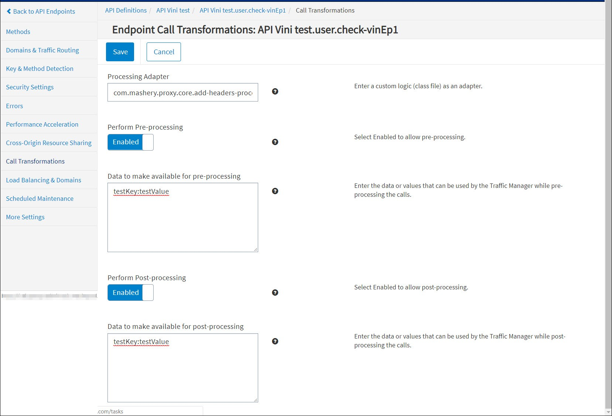

---
sidebar_position: 12
---

# Inject Static Header Connector

<head>
  <meta name="guidename" content="API Management"/>
  <meta name="context" content="GUID-6b780c24-d596-4c87-9622-b956c5498036"/>
</head>

## Description

- Connector performs pre-processing of the request and post-processing of the response to add the static headers and its value to the target request going to the backend and target response being sent to front end user/consumer based on the configuration provided in the pre/post inputs.

- Supports both pre-processing and post-processing. 

## Usage

`X-PARTNER-ID:mashery`

Injects a header X-PARTNER-ID:mashery in the backend API request for the endpoint. 

## Configuring Endpoint Processing

To configure Inject Static Header call processing for an endpoint: 

1. From the **API Management Control Center** dashboard, navigate to Design > API Definitions, then click the desired API definition from the list. 

1. Click an existing endpoint on the **Endpoints** page.

1. Click **Call Transformations** in the left-hand menu. 

1. On the **Call Transformations** page, specify the following information in these fields: 

   1. **Processing Adapter:** com.mashery.proxy.core.add-headers-processor

   1. **Perform Pre-Processing:** Enabled 

   1. **Data to make available for pre-processing:** 

      :::note
      
      Example: testKey:testValue

      :::

   1. **Perform Post-processing:** Enabled 

   1. **Data to make available for post-processing: **

      :::note
      
      Example: testKey:testValue

      :::

1. Click **Save** when done. 

## Chaining

Inject Static Headers Connector can be chained with other Boomi Cloud API Management connectors, as well as Boomi Cloud API Management adapters developed as processors. 

For more information on chaining two processors, see [Chaining Processors](../ChainingProcessorsorConnectors/Overview.md).

## Porting

Inject Static Headers connector can be ported to Local Edition customer specific bundle. 

:::note

Porting of this Connector can be performed by API Management for a specific Local Edition customer. Consult API Management Customer Success team for more information. 

:::
