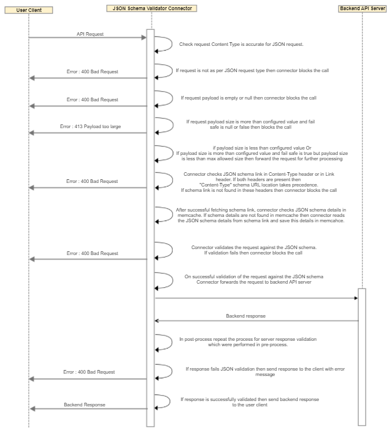

---
sidebar_position: 3
---

# Design and Implementation

<head>
  <meta name="guidename" content="API Management"/>
  <meta name="context" content="GUID-d4880f04-489a-453d-b12a-4016b55929fa"/>
</head>

## Implementation Details

- The connector checks request content-type is as per the JSON standard or not. If not then the connector blocks the call and responds to the user client with an error message. 

- If the request payload is empty or null then the connector blocks the call and responds to the user client with an error message. 

- If the payload size is more than the configured value and fail\_safe is null or false then the request is sent back to the user client with the error message "Payload Too Large".

- If the payload is more than the configurable value and fail\_safe is true then allow the call for further processing. Capture warning message in debug log. 

- Connector checks JSON schema link in `Content-Type: application/json;profile="schema-url"` or in `Link: <schema-url>;rel="describedby"` header. 

- If both headers are present then the " Content-Type " schema URL location takes precedence.

- If the JSON schema link not found then the connector blocks the call and responds to the user client with an error message.

- After fetching the schema link from the header connector checks the schema details in Memcache using the schema link as the cache key. 

- If schema details are not found in Memcache then the connector reads schema details from the schema link and save this schema details in Memcache i.e. schema link is cache key and the value is schema details. 

- After fetching schema details either from Memcache or from the schema link connector validates the incoming JSON request against this schema. If validation fails connector blocks the call and responds to the user client with an error message. 

- On successful validation of JSON, the request connector forwards the request to the backend API server. 

- In the post-process, after receiving the server response from the backend the Connector repeats the same validation process which was done for an incoming request. 

- If the response fails JSON schema validation then the error response is sent to the user client. 

- If the response is successfully validated against JSON schema then the backend server response is sent to the user client. 

## Business Rules Assumptions

1. REST API request payload should not be null or empty to validate against JSON schema. 

1. The following Content Types need to be set for valid REST API request with JSON payload: 

   1. `application/json` 

   1. `application/json;charset=UTF-8` 

   1. `application/json; profile=<schema-url>` 

1. JSON schema url should present either in Content-Type: application/json; profile=schema-url or in Link: `<schema-url>; rel="describedby"` headers.

1. If both headers are present then Content-Type: application/json; profile=schema-url takes precedence. 

1. Max payload size must be configured in pre/post inputs if we want to restrict request/response depends on the payload size. 

1. If the fail\_safe flag is true then Connector ignores payload size validation provided it is under max payload size (1024 KB) and validates the JSON against the schema with a warning message. 

## Error Messages

|**Error Name** |**HTTP Status Code** |**Cause** |
| --- | --- | ----- |
|InvalidContentTypeForRequest |400 |Request Content Type should be accurate for JSON standard. |
|RequestShouldNotBeNull |400 |API request payload is null. |
|RequestShouldNotBeEmpty |400 |API request payload is empty. |
|InvalidPreInputMaxPayloadSize |400 |Invalid value for max\_payload\_size in pre-input. |
|RequestPayLoadTooLarge |413 |Request payload size is greater than configured max\_payload\_size. |
|MissingJsonSchemaInRequestHeader |400 |JSON schema missing in the request header. |
|RequestJsonValidationFails |400 |JSON request fails in validation. |
|InvalidContentTypeForResponse |400 |Response Content type should be accurate for JSON standard. |
|ResponseShouldNotBeNull |400 |API response payload is null. |
|ResponseShouldNotBeEmpty |400 |API response payload is empty. |
|InvalidPostInputMaxPayloadSize |400 |Invalid value formax\_payload\_size in post-input. |
|ResponsePayLoadTooLarge |413 |Response payload size is greater than configuredmax\_payload\_size. |
|MissingJsonSchemaInResponseHeader |400 |JSON schema missing in the response header. |
|ResponseJsonValidationFails |400 |JSON response fails in validation. |

