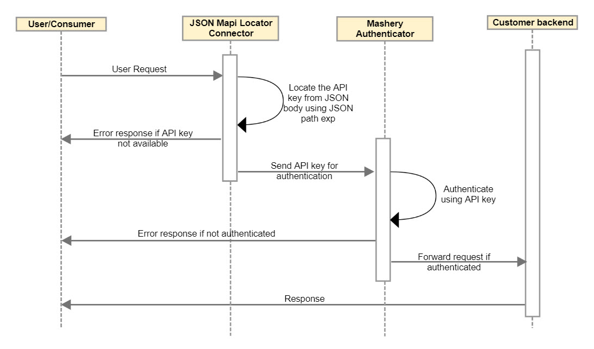
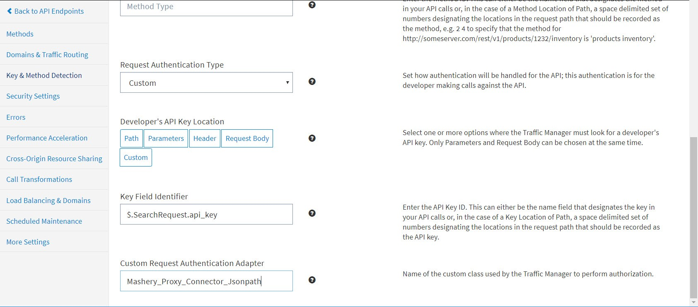

---
sidebar_position: 16
---

# JSON Body API Key Authentication Connector

<head>
  <meta name="guidename" content="API Management"/>
  <meta name="context" content="GUID-bfe4ed9f-9417-4148-aa62-48f13224f16a"/>
</head>

API Management now supports JSONPath expression in the Key Field Identifier to locate the API key from the JSON body. This connector locates the API key that is used to authenticate the API call. 

## Usage

API Management supports authentication using an API key, which can be sent in the path, parameters, header, or request body. The API key can also be located within the XML in the request body using the XPath expression as input in a **Key Field Identifier**. 

**JSON Body Sample**

The following JSON body sample for an incoming call request, demonstrates locating the API key using the connector. 

```
{
"store": {
"book": [
{
"category": "reference",
"author": "Nigel Rees",
"title": "Sayings of the Century",
"price": 8.95
},
{
"category": "fiction",
"author": "Evelyn Waugh",
"title": "Sword of Honour",
"price": 12.99,
"apikey":"7wgtjgfwfrsttejgcmm3s6rq",
},
{
"category": "fiction",
"author": "Herman Melville",
"title": "Moby Dick",
"isbn": "0-553-21311-3",
"price": 8.99
},
{
"category": "fiction",
"author": "J. R. R. Tolkien",
"title": "The Lord of the Rings",
"isbn": "0-395-19395-8",
"price": 22.99
}
],
"bicycle": {
"color": "red",
"price": 19.95
}
},
"expensive": 10
```
**Operators**

The following operators are used to locate the API key in the incoming JSON body: 

|**Operator** |**Description** |
| ----- | ---- |
|`$` |The root element to query. This starts all path expressions. |
|`@` |The current node being processed by a filter predicate. |
|`\*` |Wildcard. Available anywhere a name or numeric values are required. |
|`..` |Deep scan. Available anywhere a name is required. |
|`.<name>` |Dot-notated child. |
|`['<name>' (, '<name>')]` |Bracket-notated child or children. |
|`['<number>' (, '<number>')]` |Array index or indexes. |
|`[start:end]` |Array slice operator. |
|`[?(\<expression>\)]` |Filter expression. Expression must evaluate to a boolean value. |

**Supported JSONPaths** 

|**JSONpath** |
| --- |
|`$.store.book[\*].apikey` |
|`$..store.apikey` |
|`$.store.book..apikey` |
|`$..book[1].apikey` |
|`$..book[-3].apikey` |
|`$..book[0,1].apikey` |
|`$..book[:2].apikey` |
|`$..book[1:3].apikey` |
|`$..book[1:].apikey` |
|`$..book[?(@.apikey)].apikey` |
|`$..book[?(@.apikey =~ /.\*7wgtjgfwfrsttejgcmm3s6rq/i)].apikey` |
|`$..\*.apikey` |

## Design and Implementation

**Sequence Diagram**



**Implementation Details**

JSONPath implementation is easy and is based on actual path position. This ensures that we match the exact element. However you must provide an accurate JSONPath to fetch the API Key. 

**Debug Headers**

- If the configured JSONPath is not available then the debug header is added as follows: 

  ```xml
  if(DebugContext.isDebugging())
  DebugContext.addHeader("Configured path unavailable : ", pathNotFoundException.getMessage());
  ```

- If the incoming request contains an invalid JSON then the debug header is added as follows: 

  ```xml
  if(DebugContext.isDebugging())
  DebugContext.addHeader("Invalid Json body : ", invalidJsonException.getMessage());
  ```

- If an invalid JSONPath is configured then debug header is added as follows: 

  ```xml
  if(DebugContext.isDebugging())
  DebugContext.addHeader("Invalid path : ", invalidPathException.getMessage());
  ````

- If an io exception occurs then a debug header is added as follows: 

  ```xml
  if(DebugContext.isDebugging())
  DebugContext.addHeader("IOException : ", io.getMessage());
  ```

- If any other exception occurs then debug header is added as follows: 

  ```xml
  if(DebugContext.isDebugging())
  DebugContext.addHeader(e.getCause()+" : ", e.getMessage());
  ```

- If the API key is not in a format of string or array of string then debug header is added as follows: 

  ```xml
  if(DebugContext.isDebugging())
  DebugContext.addHeader("Apikey format is not supported. ", "Please check the incoming json body.");
  ```

- Whenever the API key is retrieved, the debug header is added as follows: 

  ```xml
  if(DebugContext.isDebugging())
  DebugContext.addHeader("API Key : ", apikey);
  ```

  Only string and array of string format values are accepted for API Key. In array of strings, if multiple values occur, then the last value is selected by default. 

## Configuring Endpoint Processing

To configure Block API call processing for an endpoint: 

1. From the API Management Control Center dashboard, navigate to Design > API Definitions, then click the desired API definition from the list. 

2. Click an existing endpoint on the Endpoints page. 

3. Click Key & Method Detection in the left-hand menu. 

4. On the Key & Method Detection page, specify the following information in these fields: 
   
   - Request Authentication Type: Custom
   
   - Key Field Identifier: $.SearchRequest.api\_key OR $..api\_key (JSONPath expression for API key as seen in the sample JSON) 
   
   - Custom Request Authentication Adapter: Mashery\_Proxy\_Connector\_Jsonpath



5. Click Save when done. 

## Sample JSON body

```xml
{
"SearchRequest":
{
"api_key":"xxx",
"search_url":"http://apigweccorpextqa.inbcu.com/latencytest/10kb"
}
}
```

## Chaining

The **JSON Body API Key Authentication Connector** can be chained with other Boomi Cloud API Management connectors, as well as Boomi Cloud API Management adapters developed as processors. 

For more information on how to chain two processors, see [Chaining Processors](../ChainingProcessorsorConnectors/). 

## Local Edition Porting

JSON Body API Key Authentication Connector can be ported to Local Edition customer specific bundle. 

Porting of this Connector can be performed by API Management for a specific Local Edition customer. For more information, consult API Management Customer Success team.

