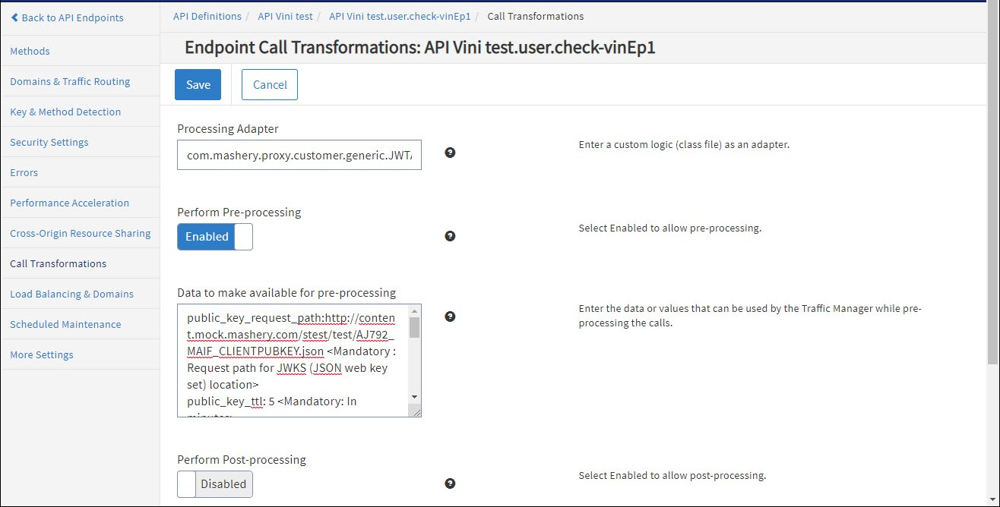

---
sidebar_position: 4
---

# Configuring Endpoint Call Processing

<head>
  <meta name="guidename" content="API Management"/>
  <meta name="context" content="GUID-3ce8e84b-28f9-4c49-bb25-05621fc3a67f"/>
</head>

To configure JWT Authentication call processing for an endpoint: 

1. From the **API Management Control Center** dashboard, navigate to Design > API Definitions, then click the desired API definition from the list.

2. Click an existing endpoint on the **Endpoints** page. 

3. Click **Call Transformations** in the left-hand menu.

4. On the **Call Transformations** page, specify the following information in these fields: 

   - **Processing Adapter:** com.mashery.proxy.customer.generic.JWTAuthProcessor 

   - **Perform Pre-Processing:** Enabled 

   - **Data to make available for pre-processing** (one per line):

|**Data** |**Example** |**Notes** |
| ------ | ---- | ----- |
|`public\_key\_request\_path:<path location>` |`public\_key\_request\_path: http://content.mock.mashery.com/stest/test/AJ792\_MAIF\_CLIENTPUBKEY.json` |Mandatory; Request path for JWKS (JSON web key set) location. |
|`public\_key\_ttl: <minutes>` |`public\_key\_ttl: 5` |Mandatory; In minutes. |
|`token\_expiry\_override: <minutes>` |`token\_expiry\_override: 5` |Optional; In minutes. |
|`iss: <string>` |`iss: https://issuer1.com, https://issuer2.com` |Optional; string values. |
|`aud: <string>` |`aud: Google, Facebook, Yahoo` |Optional; string values. |
|`nonstandard\_claims: {"<HEADER1\_NAME>":"<CLAIM1\_NAME>","<HEADER2\_NAME>":"<CLAIM2\_NAME>",..}` |`nonstandard\_claims: {"Groups":"Group1, Group2", "Whitelisted":"abc.com, xyz.com"}` |Optional: key:value pair. |
|`inject\_headers: {"<HEADER1\_NAME>":"<CLAIM1\_NAME>","<HEADER2\_NAME>":"<CLAIM2\_NAME>",..}.` |`inject\_headers: {"Audience":"aud","Issuer":"iss"}` |Optional: key:value pair. |
|`block\_authorization\_header:<true/false>` |`block\_authorization\_header: true` |Optional; boolean values - true or false. Default Value - false. |
|`http\_proxy\_server : <string>` |`http\_proxy\_server: squid.example.com` |Optional; String values. Proxy Server to retrieve JWKS. |
|`http\_proxy\_port : <integer>` |`http\_proxy\_port: 3128` |Optional; Integer value. Proxy Server Port to retrieve JWKS. |
|`customizeErrorEnable: <true/false>`|`customizeErrorEnable: true`|
Support of configurable parameter customizeErrorEnable to control error response code sent by API Management. 

JWT Authentication Connector returns ERR\_403\_NOT\_AUTHORIZED in case of error. If customizeErrorEnable is configured as "true", HTTP response status code and status text for connector is overridden by error set defined for that endpoint in API Management Control Center. If customizeErrorEnable is configured with value other than "true", then there is no change in Mashery Connector existing functionality that responds with ERR\_403\_NOT\_AUTHORIZED for backend server response code with 403 for unauthorized calls.
|

5. Click Save when done. 

:::note
- There should be no space between two nonstandard claims and two inject headers. 

  - Ex - `nonstandard\_claims: {"Groups":"Group1, Group2" , "Whitelisted":"abc.com, xyz.com"} and inject\_headers: {"Audience":"aud" , "Issuer":"iss"}` will not work. 

- Special character `":"` is not allowed in header name. 

- Proxy port can be specified either in http\_proxy\_server as "http\_proxy\_server : squid.example.com:3128" or as different parameter like "http\_proxy\_port : 3128". In case proxy port is specified on both locations, then preference is given to the value of "http\_proxy\_port". 

:::

