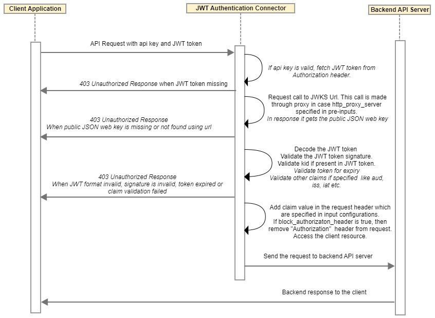
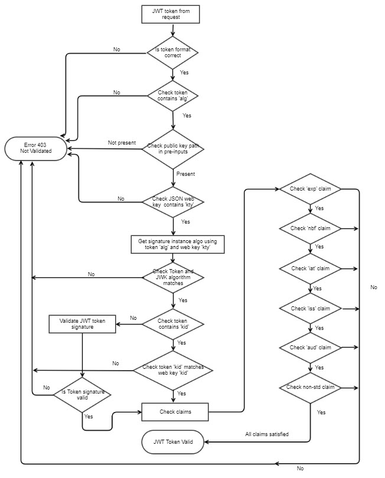

---
sidebar_position: 3
---

# Design and Implementation

<head>
  <meta name="guidename" content="API Management"/>
  <meta name="context" content="GUID-5a779434-9d58-44f3-a7a1-09abb22ffc79"/>
</head>

## Sequence Diagram



## Implementation Details

- User client sends third party JWT token in the Authorization header of the API call along with the API Management Key. 

- Connector authenticates based on api key retrieved from the incoming API request. 

- If API call is authenticated at API Management successfully, then Connector looks for token in the Authorization header, otherwise the request is blocked from API Management and error response with message is returned. 

- If JWT token is not missing then Connector fetches the JSON web key (JWK) from the public key URL specified in the input configuration that holds JSON Web Key Set (JWKS). 

- JSON Web Key Set is cached in API Management Memcache for fixed time in order to fulfill future calls or transactions for faster response. 

- If http\_proxy\_server specified in the pre-input configurations, call to retrieve JSON Web Key Set (JWKS) is made through proxy server. 

**Block Authorization Header Feature**

- If "block\_authorization\_header" in pre-input is true, then after JWT token validation, "Authorization" header is removed from the request which is sent to the backend API server. 

- Default value of "block\_authorization\_header" is false. 

**Inject Headers Feature**

- In case JWT validation is successful, inject\_headers values are retrieved from pre-input. 

- From JWT token, claim value for specified claim or JSON Path expression, in the pre-input is retrieved and added into request header. 

- Example - `inject\_headers: {"X-Mashery-User-Context":"uctx","X-Mashery-Scope":"aud","X-Mashery-App-Id":"$.pib.master\_app\_id"}`. In this case, three headers are added in the request: 

  - Header Name - X-Mashery-User-Context and Header Value - "uctx" claim value in jwt token. 

  - Header Name - X-Mashery-Scope and Header Value - "aud" claim value in jwt token. 

  - Header Name - X-Mashery-App-Id and Header Value - Claim value retrieved from JWT payload using provided JSON Path expression: $.pib.master\_app\_id

- JSON Path expression can extract value from JWT payload for non-standard claims only. 

- Header value is UTF-8 encoded. 

- In case specified claim or value fetched from JSON Path expression, is not present in JWT token, then no corresponding header is added in the request. 

- Specified claims in pre-inputs which are present in JWT payload, only those claims is added as header in the request. 

- In case any claims specified in the pre-input is present inside JWT header, it is not added to the request. For example: `inject_headers: {"X-Mashery-JWT-Algorithm":"alg"}`. In this case, "X-Mashery-JWT_Algorithm" header is not added in the request as "alg" claim is present in JWT token header. 

## Token Validation Rules and Checks

### JWT Token Validation Flow



**Supported Claims** 

- exp 

  - The "exp" (expiration time) claim identifies the expiration time on or after which the JWT MUST NOT be accepted for processing. 

  - The processing of the "exp" claim requires that the current datetime MUST be before the expiration datetime listed in the "exp" claim. 

  - Use of this claim is OPTIONAL. 

- iat 

  - The "iat" (issued at) claim identifies the time at which the JWT was issued. 

  - This claim can be used to determine the age of the JWT. 

  - Its value MUST be a number containing a NumericDate value 

  - Use of this claim is OPTIONAL.

- iss 

  - The "iss" (issuer) claim identifies the principal that issued the JWT. 

  - The processing of this claim is generally application specific. The "iss" value is a case-sensitive string containing a StringOrURI value.

  - Use of this claim is OPTIONAL. 

- aud 

  - The "aud" (audience) claim identifies the recipients that the JWT is intended for. 

  - Each principal intended to process the JWT MUST identify itself with a value in the audience claim.

  - If the principal processing the claim does not identify itself with a value in the "aud" claim when this claim is present, then the JWT MUST be rejected. 

  - In the general case, the "aud" value is an array of case-sensitive strings, each containing a StringOrURI value. 

  - In the special case when the JWT has one audience, the "aud" value MAY be a single case-sensitive string containing a StringOrURI value. 

  - The interpretation of audience values is generally application specific. 

  - Use of this claim is OPTIONAL.
  
- nbf 

  - The "nbf" (not before) claim identifies the time before which the JWT MUST NOT be accepted for processing.

  - The processing of the "nbf" claim requires that the current datetime MUST be after or equal to the not-before datetime listed in the "nbf" claim. 

  - Implementers MAY provide for some small leeway, usually no more than a few minutes, to account for clock skew. 

  - Its value MUST be a number containing a NumericDate value. 

  - Use of this claim is OPTIONAL. 

- nonstandard_claims (custom claims) 

  :::note
  
  In nonstandard_claims, we have any claim name which can be validated against the value configured in pre-inputs. 

  :::

### Token Structure Verification

- Connector verifies the third party JWT token structure. In case JWT structure is malformed, an error response with message is returned.

- API Management decodes JWT token using standard base64 decode library to retrieve header and payload. 

- In JWT token, JWT header standard fields (typ, cty, alg, jku, jwk, x5c, x5t, kid) is not allowed in the JWT token payload. 

- In JWT token, JWT standard claims (sub, nbf, iat, iss, aud, exp, jti) is not allowed in the JWT token header.

- In case JSON Web Key or key id is unavailable or inaccessible from URL path specified in pre-inputs, then an error response with message is returned. 

### Token Signature Verification

1. Connector validates the JWT signature using the algorithm and JSON Web Key information. 

   1. It needs 'kty' claim in JSON Web Key to check algorithm key type. 

   1. Connector retrieves 'alg' claim from JWT header to verify the signature. 

   1. Connector verifies algorithm mentioned in JSON Web Key and JWT token header should match in case algorithm is specified in JSON Web Key. 

   1. Algorithms supported are as follows. These are compliant to JSON Web Algorithms (JWA) RFC. `<https://tools.ietf.org/html/RFC7518>`

      |**'alg' param value** |**Digital Signature or MAC Algorithm** |**Expected 'kty' in JSON Web Key** |**Expected Parameters in JSON Web Key for Signature Validation** |
      | :-: | :-: | :-: | :-: |
      |RS256 |SHA256withRSA |RSA |<p>Modulus Parameter - n </p><p>Exponent Parameter - e </p>|
      |RS384 |SHA384withRSA |RSA |<p>Modulus Parameter - n </p><p>Exponent Parameter - e </p>|
      |RS512 |SHA512withRSA |RSA |<p>Modulus Parameter - n </p><p>Exponent Parameter - e </p>|
      |ES256 |SHA256withECDSA |EC |<p>Curve Parameter - crv : P-256 </p><p>X-Coordinate of Elliptic Curve Point - x </p><p>Y-Coordinate of Elliptic Curve Point - y </p>|
      |ES384 |SHA384withECDSA |EC |<p>Curve Parameter - crv : P-384 </p><p>X-Coordinate of Elliptic Curve Point - x </p><p>Y-Coordinate of Elliptic Curve Point - y </p>|
      |ES512 |SHA512withECDSA |EC |<p>Curve Parameter - crv : P-521 </p><p>X-Coordinate of Elliptic Curve Point - x </p><p>Y-Coordinate of Elliptic Curve Point - y </p>|

1. Connector additionally verifies the JWT token signature either one of the below two ways: 

   - For RSA, connector uses modulus (n) and exponent (e) inside JSON Web Key (JWK) to validate the token. 

   - For ECDSA, connector uses x coordinate (x), y coordinate (y) and (d) inside JSON Web Key (JWK) to validate the token. 

### Token Claims Verification

- If the incoming JWT token header is having 'kid' claim, then Connector matches incoming 'kid' value with the JWK kid value. If both are matching, then claim verifications is done. 

- JWT token expiry is checked as per the 'iat' (issued at) and 'exp' (expiry) claims coming in JWT token. 

- Expiry time can also be (optionally) configurable under pre-inputs for overriding default JWT token expiry.

  - The shorter expiry of the above two (JWT token expiry claim and expiry time configured under pre-input) is used for token expiration validation check. 

  - If there is no "iat (issued at) claim" coming with JWT AND no pre-input configuration for "token\_expiry" 

    - JWT token expiry validation check does not occur. 

## Error Handling and Messages

- All JWT errors is returned as "403" type errors. 

- Error contains information depending on the point of error, for example:

  - missing token 

  - validation failure (timestamp check, etc.) 

  - signature failure 

  - public JSON Web key/key id unavailable/error 

- Connector checks the data integrity of the JWT token using defined validation rules & checks above. 

- On successful validation Connector will route call to the customer backend resources, otherwise returns 403 not authorized error. 

## Business Rules and Assumptions

1. nonstandard\_claims in JWT token payload format should be in string value only: 

   ```
   "groups":"b83c8150-cbf9-4767-bb65-fee0809292f1"
   ```

2. Audiences in JWT token payload format should be in array of strings or string format only: 

    ```
    "aud": [
    "Google", "Facebook"
    ]
    ```

    ```
    "aud":"Facebook"
    ```

3. JWT token should be generated in the same time zone as the local system time zone; otherwise, there will be a time zone difference which will impact the expected behavior. 

