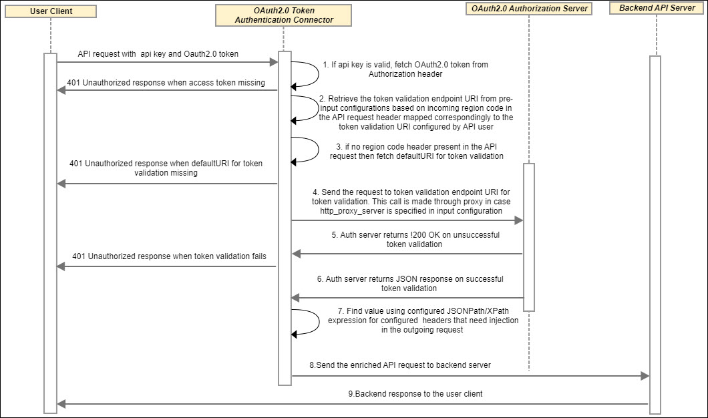

---
sidebar_position: 3
---

# Design and Implementation

<head>
  <meta name="guidename" content="API Management"/>
  <meta name="context" content="GUID-967fbe08-5850-46cf-8123-cacada6bf9e7"/>
</head>

## System Architecture and Flow

Refer to the System Archtecture Flow for [Business Use Cases Feasible Using Third Party OAuth 2.0 Token Connector](../../MasheryConnectorUseCases/BusinessUseCasesFeasibleUsingThirdPartyOAuth2.0Token/Overview.md). 

## Sequence Flow Diagram

## Implementation Details

- User client sends third party OAuth token in the Authorization header of the API call along with the API Management Key
 
- Connector authenticates based on api key retrieved from the incoming API request. 

- If API call is authenticated at API Management successfully, then Connector looks for token in the Authorization header, otherwise the request is blocked from API Management and error response with message is returned.

- If OAuth token is not missing, then the Connector retireves OAuth token validation endpoint on basis of region code header. If OAuth token validation endpoint is not specified for incoming region code header, then default OAuth token validation endpoint is retrieved from pre-inputs. 

- If default OAuth token validation endpoint is not specified in pre-inputs, then error response with message is returned. 

- Response is retrieved from OAuth token validation endpoint. If http\_proxy\_server and http\_proxy\_port is specified in pre-input, then call to oauth token validation endpoint will go through proxy server. 

- If response code is not 200, then error response with message is returned. 

- If response code is 200, then Connector retrieves inject\_headers configuration on basis of region code header. If inject\_headers configuration for specific region code is not present, then default inject\_header configuration is retreived.

- Connector injects request headers according to inject headers configuration on basis of JSONPath/XPath. For JSONPath, response from oauth token validation endpoint should be valid json and should contain proper content type header value related to JSON. For XPath, response from oauth token validation endpoint should be valid xml and should contain proper content type header value related to XML. 

- If block\_authorization\_header is specified as true in pre-input configuration, then authorization header will be removed from target request before sending it to target endpoint.

## Business Rules and Assumptions

- Consuming app is responsible for acquiring OAuth2.0 access token upfront. 

- Third party IDP (Authorization server) should support remote OAuth2.0 access token validation by exposing introspection endpoint. 

  - Token validation endpoint must return response 200 OK code for successful token validation. 

  - Any !200 OK response code including 401 UnAuthorized is considered unsuccessful token validation. 

- API Management should be able to access introspection endpoint remotely. 

## Error Messages

|**Error Name** |**HTTP Status Code** |**Cause** |
| ---- | --- | --- |
|AuthorizationHeaderNotPresentInRequest |401 |Either authorization header not present in request or its value is not defined in the request. |
|InvalidPreInputConfigurationForTokenValidationURI |401 |Either token validation URI is not defined in pre-inputs or its value is not in proper required json format. |
|DefaultTokenValidationURINotPresent |401 |Default token validation URI not provided in pre-inputs configuration. |
|TargetEndpointError |401 |Unable to retrieve response from OAuth Token Validation Endpoint. |
|TokenValidationFails |401 |Response code 200 not retrieved from OAuth Token Validation Endpoint. |

