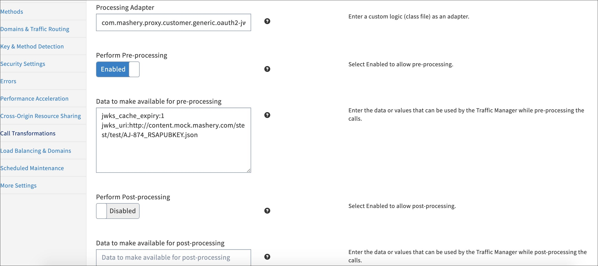

# Configuring Endpoint Call Processing

<head>
  <meta name="guidename" content="API Management"/>
  <meta name="context" content="GUID-9fd22b0c-0c5c-4794-a1b7-5076ca7a0079"/>
</head>

Sample example below shows how to configure an endpoint that meets following requirements. Provide simultaneous support of legacy API Management OAuth2 access token and JWT on the same endpoint. 

1. From the API Management Control Center dashboard, navigate to Design > API Definitions, then click the desired API definition from the list. 

2. Click an existing endpoint on the Endpoints page. 

3. Click Key & Method Detection in the left-hand menu.

   

   Specify information for the following fields:

   - **Request Authentication Type:** Custom

   - **Developer's API Key Location:** Custom 

   - **Key Field Identifier:** `<fieldname to identify in payload claim>`

      :::note
      
      Key Field Identifier must not be a [registered claim](https://datatracker.ietf.org/doc/html/rfc7519#section-4.1). 

      :::

   - Custom Request Authentication Adapter: com.mashery.proxy.customer.generic.oauth2-jwt-authenticator 

4. Click **Call Transformations** in the left-hand menu. 

5. On the **Call Transformations** page, specify the following information in these fields: 
   
   - **Processing Adapter:** com.mashery.proxy.customer.generic.oauth2-jwt-authenticator
   
   - **Perform Pre-Processing:** Enabled 
   
   - **Data to make available for pre-processing:** (one per line): 

|**Data** |**Example** |**Notes** |
| ------ | ---- | ----- |
|`jwks\_uri: <path location>` |`jwks\_uri: http://content.mock.acme.com/stest/test/AJ792\_MAIF\_CLIENTPUBKEY.json` |Mandatory; Request path for JWKS (JSON web key set) location |
|`jwks\_cache\_expiry: <minutes>` |`jwks\_cache\_expiry: 5` |Mandatory; In minutes |
|`token\_expiry\_override: <minutes>` |`token\_expiry\_override: 5` |Optional; In minutes. Override JWT expiry with configured time that should be less than original JWT ttl. |
|`iss: <string>` |`iss: https://issuer1.com/ , https://issuer2.com/` |Optional; string values |
|`aud: <string>` |`aud: Google, Facebook, Yahoo` |Optional; String values |
|`nonstandard\_claims: {"<HEADER1\_NAME>":"<CLAIM1\_NAME>","<HEADER2\_NAME>":"<CLAIM2\_NAME>",..}` |nonstandard\_claims: \{"Groups":"Group1, Group2", "Whitelisted":" abc.com , xyz.com "\} |Optional; key:value pair |
|`inject\_headers: {"<HEADER1\_NAME>":"<CLAIM1\_NAME>","<HEADER2\_NAME>":"<CLAIM2\_NAME>",..}` |inject\_headers: \{"Audience":"aud","Issuer":"iss","X-Mashery-App-Id":"$.pib.master\_app\_id"\} |Optional; key:value pair |
|`block\_authorization\_header:<true/false>` |`block\_authorization\_header : false` |
Optional; boolean values - true or false. Default Value - true 

This setting is only applicable for JWT token which needs to get forwarded/blocked to origin server. 
|
|`http\_proxy\_server : <string>` |`http\_proxy\_server : squid.example.com` |Optional; String values. Proxy Server to retrieve JWKS. |
|`http\_proxy\_port : <integer>` |`http\_proxy\_port : 3128` |Optional; Integer value. Proxy Server Port to retrieve JWKS. |
|`shared\_token\_spkey:<string>` |`shared\_token\_spkey:942yzkggypg5dq6c4ucfv3ed` |
Optional; String value. SPKey of another API service, where OAuth2 token is generated. 

Provide this preinput parameter only when OAuth2 tokens generated from another API Service needs to be validated at this endpoint. 
|

6. Click **Save** when done. 

