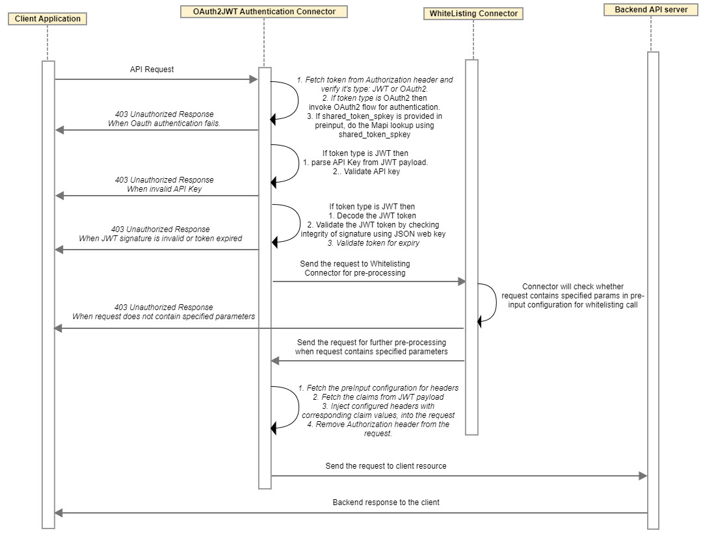
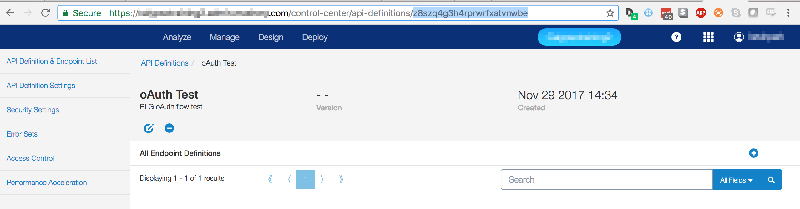

# Design and Implementation

<head>
  <meta name="guidename" content="API Management"/>
  <meta name="context" content="GUID-334897e6-7971-4cf1-aff5-08f1ca222b38"/>
</head>

## Sequence Diagram

## Sequence Diagram With WhiteList Connector Chaining (Sample Reference)

## Implementation Details

1. This connector fetches the value of Authorization header from incoming request and if the token is in the format: `<String>.<String>.<String>`, then the type of token is JWT else API Management OAuth2 access token. 

1. If token type is API Management OAuth2, then use Mapi locator service in Connector applying following logic:

   1. Set service endpoint OAuth grant types to 'client\_credentials', 'authorization code', 'implicit' and 'Password'. (As Endpoint configuration doesn't have a way to select grant type credentials). 

   1. Proceed with API Management OAuth2 authentication flow and exit. 

1. If token type is third-party JWT, then: 

   1. Fetch the API key (client\_id) from JWT payload claim (configurable on the API Management Endpoint Key & Method Detection page) and do validation, else throw HTTP 403 error and exit. 

1. Connector fetches the mandatory preInput configuration for jwks\_uri and makes the call to fetch JWK (JSON Web Key) from JWKS (JSON Web Key Set). 

   1. If optional http\_proxy\_server specified in the pre-input configurations, call to retrieve JSON Web Key Set (JWKS) is made through proxy.

1. Depending upon response from previous call, perform the validation on JWT signature and expiry, else throw HTTP 403 error and exit. 

1. Depending upon the configuration of standard and non-standard claims, corresponding API request is accepted or blocked for augmented validation needed in business policies/rules.

1. Connector optionally provides configuration for: inject\_headers and injects the corresponding headers into the request. 

1. Connector optionally provides configurable capability to block/forward authorization header to backend/origin server. 

**Block Authorization Header Feature**

- If "block\_authorization\_header" in pre-input is true, then after JWT token validation, "Authorization" header is removed from the request which will be sent to the backend client resources. 

- Default value of "block\_authorization\_header" is true. 

**Shared Token SPKey Feature**

- At the endpoint, to authenticate the API Management OAuth2.0 tokens generated from different API Service, add the below parameter in pre-input configuration: 

  `shared\_token\_spkey:<SPKey of another API Service>`

- **Caution:** 
  - There is no need to chain with: com.mashery.proxy.customer.generic.oauth2-shared-token-adapter. 

  - Provide this preinput parameter only when OAuth2 tokens generated from another API Service needs to be validated at this endpoint. 

- If shared\_token\_spkey is defined in pre-input configuration 

  - Service configuration is loaded using this shared token spkey and oauth2 context is created using this service configuration. 

  - Original spkey is stored and replaced by shared spkey. 

  - API Management Mapi look-up is done using this shared spkey. After Mapi look-up, original spkey is restored in the service configuration. 

:::note

You can find the value of 'shared\_token\_spkey' easily by taking the 'API Definition' ID from the URL in the browser: (Sample reference)

:::

## Inject Headers Feature

Refer to the [Inject Headers Feature](../JWTAuthenticationConnector/Design_and_implementation_13.md) section for JWT Authentication Connector.

## Token Validation Rules and Checks

Refer to the [Token Validation Rules and Checks](../JWTAuthenticationConnector/Design_and_implementation_13.md) section for JWT Authentication Connector. 

## Business Rules and Assumptions

Refer to the [Business Rules and Assumptions](../JWTAuthenticationConnector/Design_and_implementation_13.md) section for JWT Authentication Connector. 
