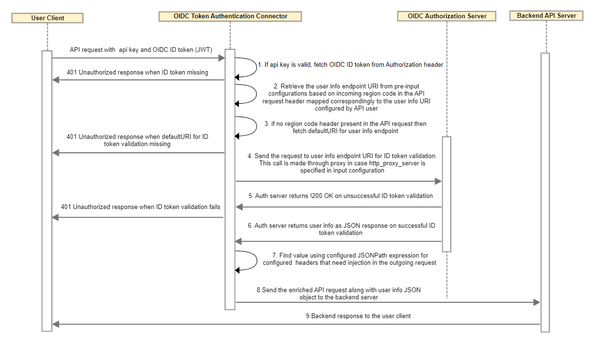

---
sidebar_position: 3
---

# Design and Implementation

<head>
  <meta name="guidename" content="API Management"/>
  <meta name="context" content="GUID-05e0176c-9505-4adf-a79e-c447386fd2d7"/>
</head>

## System Architecture and Flow

Refer [Business Use Cases Feasible Using Third Party OAuth2.0 Token](../../MasheryConnectorUseCases/BusinessUseCasesFeasibleUsingThirdPartyOAuth2.0Token/Overview.md)

## Sequence Flow Diagram

## **Implementation Deatils**

1. User client sends third party OIDC token in the Authorization header of the API call along with the API Management Key. 

1. Connector authenticates based on api key retrieved from the incoming API request. 

1. If API call is authenticated at API Management successfully, then Connector looks for ID token in the Authorization header; otherwise the request is blocked from API Management, and error response with message is returned. 

1. If OIDC token is not missing, then Connector retrieves OIDC token user info endpoint on basis of region code header. If OIDC token validation endpoint is not specified for incoming region code header, then default OIDC token validation endpoint is retrieved from pre-inputs. 

1. If default OIDC ID token validation endpoint is not specified in pre-inputs, then error response with message is returned. 

1. Response is retrieved from OIDC user info endpoint. If http\_proxy\_server and http\_proxy\_port is specified in pre-input, then call to OIDC token validation endpoint will go through proxy server. 

1. If response code is not 200, then error response with message is returned. 

1. If response code is 200, then Connector retrieves inject\_headers configuration on basis of region code header. If inject\_headers configuration for specific region code is not present, then default inject\_header configuration is retrieved.

1. Connector injects request headers according to inject headers configuration on basis of JSONPath. For JSONPath, response from OAuth token validation endpoint should be valid json and should contain proper content type header value related to JSON. Refer [JSONPath and XPath user guide](../../../ConnectorGuides/JSONPathandXPathUserGuide/Overview.md). 

1. If block\_authorization\_header is specified as true in pre-input configuration, then authorization header is removed from target request before sending it to target endpoint. 

## Business Rules and Assumptions

- Consuming app is responsible for acquiring OIDC ID token upfront. 

- Consuming app acts as a Relaying Party (RP) and responsible to initiate OIDC token fetching. 

- Third party IDP (Authorization server) should support remote OIDC token validation by exposing user info endpoint. 

- Token validation endpoint must return response **200 OK** code for successful token validation. 

- Any !200 OK response code including **401 UnAuthorized** is considered unsuccessful ID token validation. 

- API Management should be able to access user info endpoint remotely. 

## Error Handling

|**Error Name** |**HTTP Status Code** |**Cause** |
| ---- | ---- | --- |
|`InvalidAuthorizationHeaderValue` |`401` |Either authorization header not present in request or its value is not defined in the request or its value does not start with 'Bearer' scheme. |
|`InvalidPreInputConfigurationForUserInfoEndpointURI` |`401` |Either userinfo endpoint URI is not defined in pre-inputs or its value is not in proper required json format. |
|`DefaultUserInfoURINotPresent` |`401` |Default userinfo endpoint URI not provided in pre-inputs configuration. |
|`TargetEndpointError` |`401` |Unable to retrieve response from UserInfo Endpoint. |
|`<Error Status Message From OpenID IDP in case of token validation fails>` |`<Status Code returned by OpenID IDP>` |Response code 200 not retrieved from UserInfo Endpoint. |

## UserInfo Error Response Handling

When an error condition occurs, the UserInfo Endpoint returns an Error Response as defined in Section 3 of OAuth 2.0 Bearer Token Usage [RFC6750]. (HTTP errors unrelated to RFC 6750 are returned to the User Agent using the appropriate HTTP status code.) Different possible UserInfo Error Response Handling Scenarios are as below. 

|**S. No.** |**Scenario** |**UserInfo Endpoint Response** |**Pre-input Configurations** |**API Management Gateway Response to User Client** |**Additional Notes** |
| ----- | ----- | ---- | ----- | ----- | ---- |
|1\. |UserInfo Endpoint returns 401 Unauthorized Error Response with details in WWW-Authenticate Header. |
HTTP/1.1 401 Unauthorized 

WWW-Authenticate: error="invalid\_token" , error\_description="The Access Token expired" 
|
error\_metadata\_location:ResponseHeaders 

error\_header\_name:WWW-Authenticate 
|
HTTP Status Code - 401 

HTTP Status Message -Unauthorized 

HTTP Status Response Body - 

<h1>error="invalid\_token" , error\_description="The Access Token expired"</h1> 
|Response body is retrieved from WWW-Authenticate header as specified in pre-input configuration. |
|2\. |UserInfo Endpoint returns 403 Forbidden Error Response with details in WWW-Authenticate Header. |
HTTP/1.1 403 Forbidden 

Expires:0 

WWW-Authenticate: Bearer error="insufficient\_scope" , error\_description="The Access Token must provide access to these at least one of the scopes - profile, email, address or phone" 
|
error\_metadata\_location:ResponseHeaders 

error\_header\_name:WWW-Authenticate 
|
HTTP Status Code - 403 

HTTP Status Message -Forbidden 

HTTP Status Response Body - 

<h1>Bearer error="insufficient\_scope" , error\_description="The Access Token must provide access to these at least one of the scopes - profile, email, address or phone"</h1> 
|Response body is retrieved from WWW-Authenticate header as specified in pre-input configuration. |
|3\. |UserInfo Endpoint returns 401 Unauthorized Error Response with details in response Body. |
HTTP/1.1 401 Unauthorized 

Content-Type: application/json 

Cache-Control : no-store 

Pragma : no-cache 

\{ 

"error" : "invalid\_token", 

"errorMessage" : "The access token expired" 

\} 
|
error\_metadata\_location:ResponsePayload 

error\_header\_name:$.errorMessage 
|
HTTP Status Code - 401 

HTTP Status Message -Unauthorized 

HTTP Status Response Body - 

<h1>The Access Token expired</h1> 
|Response body is retrieved using JSONPath expression from response payload as specified in pre-input configuration. |
|4\. |UserInfo Endpoint returns 401 Unauthorized Error Response with details in WWW-Authenticate Header but error\_header\_name not specified in pre-input configuration. |
HTTP/1.1 401 Unauthorized 

WWW-Authenticate: error="invalid\_token" , error\_description="The Access Token expired" 
|
error\_metadata\_location:ResponseHeaders 

error\_header\_name: 

OR 

error\_metadata\_location:ResponseHeaders 

error\_header\_name not specified in pre-inputs 
|
HTTP Status Code - 401 

HTTP Status Message -Unauthorized 

HTTP Status Response Body - 

<h1>Error Response retrieved from UserInfo endpoint. Response Code - 401</h1> 
|As error\_header\_name is not specified, response body is default message from Mashery Connector. |
|5\. |UserInfo Endpoint returns 403 Forbidden Error Response with details in response body but error\_payload\_location not specified in pre-input configuration. |
HTTP/1.1 403 Forbidden 

Expires:0 

\{ 

"error" : "invalid\_token", 

"errorMessage" : "The access token expired" 

\} 
|
error\_metadata\_location:ResponsePayload 

error\_payload\_location: 

OR 

error\_metadata\_location:ResponsePayload 

error\_payload\_location not specified in pre-inputs 
|
HTTP Status Code - 403 

HTTP Status Message -Forbidden 

HTTP Status Response Body - 

<h1> \{"error" : "invalid\_token", "errorMessage" : "The access token expired"\} </h1> 
|As error\_payload\_location is not specified, completer error response from OpenIDP is set as response body which is sent to user client. |
|6\. |UserInfo Endpoint returns 400 Bad Request Error Response with details in response body but error\_metadata\_location not specified or invalid value specified in pre-inputs. |
HTTP/1.1 400 Bad Request 

Content-Type: application/json 

Cache-Control : no-store 

Pragma : no-cache 

\{"error" : "invalid\_request", 

"errorMessage" : "Request does not contain valid authorization header"\} 
|
error\_metadata\_location : 

OR 

error\_metadata\_location not specified in pre-inputs 

OR 

error\_metadata\_location: QueryParameter 
|
HTTP Status Code - 400 

HTTP Status Message -Bad Request 

HTTP Status Response Body - 

<h1>Error Response retrieved from UserInfo endpoint. Response Code - 400</h1> 
|As error\_metadata\_location is not specified, response body is default message from Mashery Connector. |
|7\. |UserInfo Endpoint returns 403 Forbidden Error Response with details in WWW-Authenticate Header but invalid value specified in error\_header\_name |
HTTP/1.1 403 Forbidden 

Expires:0 

WWW-Authenticate: Bearer error="insufficient\_scope" , error\_description="The Access Token must provide access to these at least one of the scopes - profile, email, address or phone" 
|
error\_metadata\_location:ResponseHeaders 

error\_header\_name:ErrorHeader 
|
HTTP Status Code - 403 

HTTP Status Message -Forbidden 

HTTP Status Response Body - 

<h1>Error Response retrieved from UserInfo endpoint. Response Code - 403</h1> 
|As "ErrorHeader" is not present in OpenIDP Error Response, response body is default message from Mashery Connector. |
|8\. |UserInfo Endpoint returns 401 Unauthorized Error Response with details in response Body but invalid jsonpath specified in pre-input configuration. |
HTTP/1.1 401 Unauthorized 

Content-Type: application/json 

Cache-Control : no-store 

Pragma : no-cache 

\{ 

"error" : "invalid\_token", 

"errorMessage" : "The access token expired" 

\} 
|
error\_metadata\_location:ResponsePayload 

error\_header\_name:$.message 
|
HTTP Status Code - 401 

HTTP Status Message -Unauthorized 

HTTP Status Response Body - 

<h1>Error Response retrieved from UserInfo endpoint. Response Code - 403</h1> 
|As invalid JSONPath is specified for error\_payload\_location, response body is default message from Mashery Connector. |
|9\. |UserInfo endpoint returns 500 Server Error repose with no payload and error\_metadata\_location specified as ResposnePayload. |HTTP/1.1 500 Server Error |error\_metadata\_location:ResponsePayload |
HTTP Status Code - 500 

HTTP Status Message -ServerError 

HTTP Status Response Body - 

<h1>Error Response retrieved from UserInfo endpoint. Response Code - 500</h1> 
|In case no response body is retrieved from OpenID IDP, response body is default message from Mashery Connector. |

HTTP status code and status message is always returned to the User Client which is retrieved from OpenID IDP in case of error response from OpenID IDP. 
