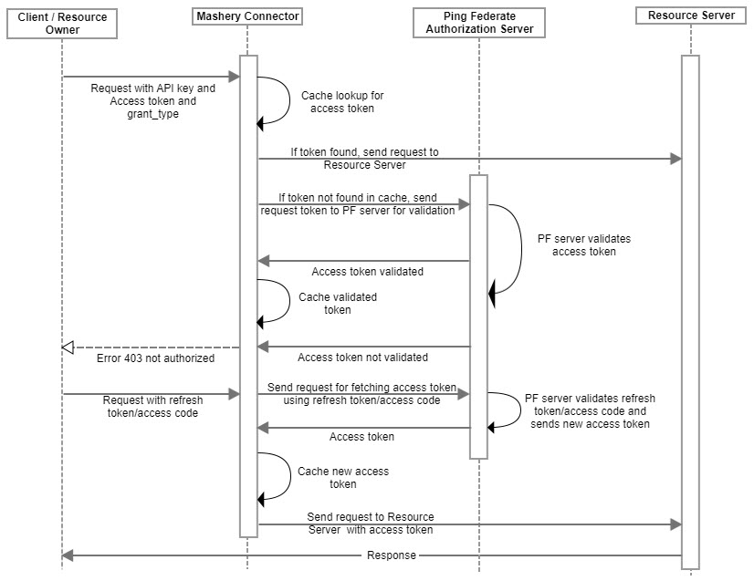

---
sidebar_position: 3
---

# Design and Implementation

<head>
  <meta name="guidename" content="API Management"/>
  <meta name="context" content="GUID-7152d197-79be-4fb2-ad30-67d3ce5c0c8f"/>
</head>

## Supported Grant Types

**Grant type: Client Credentials**

- This connector supports '[Client Credentials](https://tools.ietf.org/html/rfc6749#section-4.4)' as the 'Authorization Grant type'. 

- The connector sends the request to Ping Federate endpoint (Authorization server) with the client\_id as the credentials, which is configured in the pre-input field. 

- The Authorization server authenticates the API call with the credentials, and if valid, issues an access token. 

- The access token is cached according to the expiry time of the access token and reused for subsequent requests.

- If the request comes in with the access token and the token is not in cache, the connector sends the token to Ping Federate server for authentication. 

- If the token from incoming request is expired or invalid, the connector returns an error. 

- '[Client Credentials](https://tools.ietf.org/html/rfc6749#section-4.4)' grant type does [not include](https://tools.ietf.org/html/rfc6749#section-4.4.3) refresh token. 

**Grant type: Password**

- This connector also supports '[Resource Owner Password Credentials](https://tools.ietf.org/html/rfc6749#section-4.3)' as the 'Authorization Grant type'. 

- In this case, the client requests access token from the Authorization server by including the resource owner credentials.

- When making the request, the client authenticates with the Ping Federate authorization server. 

- The Ping Federate authorization server authenticates the client and validates the resource owner credentials, and if valid, issues an access token. It can also include an optional refresh token. 

- If the token is expired, the connector returns an error and the client must send a request with refresh token for generating a new access token. 

- If the request comes with the refresh token, the connector sends this refresh token to the Ping Federate server. The Ping Federate server returns a new access token. 

**Grant type: Implicit**

- For [Implicit grant type](https://tools.ietf.org/html/rfc6749#section-4.2), the client requests access token from the Authorization server by sending the client\_id and redirection URI. 

- The Authorization server authenticates the resource owner and establishes whether the resource owner grants or denies the client's access request. 

- If the resource owner grants the access request, the Authorization server issues an access token by adding it as a parameter to the fragment component of the redirection URI. 

- The connector extracts this token and caches it for further requests till it expires. 

- Using Implicit grant type does not return a refresh token. The response is not JSON and the HTTP status code is 302. 

**Grant type: Authorization Code**

- The [Authorization Code grant type](https://tools.ietf.org/html/rfc6749#section-4.1) is a redirection-based flow used to obtain both access tokens and refresh tokens and is optimized for confidential clients. 

- The Authorization server authenticates the resource owner and and establishes whether the resource owner grants or denies the client's access request. 

- If the resource owner grants the access request, the Authorization server issues an authorization code by adding it as a query component of the redirection URI. 

- The client requests an access token from the Authorization server's token endpoint by including the authorization code received earlier. 

- When making the request, the client authenticates with the Authorization server and includes the redirection URI used to obtain the authorization code for verification.

- The Authorization server authenticates the client and validates the authorization code.

- If valid, the Authorization server responds back with an access token and, optionally, a refresh token. 

## Sequence Diagram

**Request For Fetching Access Token**

The API request does not include the access token in Authorization header.


**Request For Validating Access token**

The API request contains the access token in the Authorization header.



## Implementation Details

1. The connector checks if the API request Authorization header contains the access token. 

1. **Client credentials** and **Password grant type**

   If the Authorization header does not contain the access token, the connector follows this flow for fetching the access token from the Ping Federate server. 

   1. The connector fetches the pre-inputs map from the connector context. 

   1. It fetches the Ping Federate server URL from pf\_base\_url and client credentials from pf\_oauth\_client which is encoded/encrypted (client\_id:client\_secret). 

      1. For password grant type, the connector also needs resource owner username and password. This is available in another pre-input configuration pf\_oauth\_user in encoded format. 

      1. The connector decodes using Base64 decoding. 

   1. The connector makes a call to the Ping Federate server for fetching access token.

      1. The above encoded auth string is added as a Basic Authentication header to this request. 

      1. The request body contains the following details: 

         ```xml
         // grant type: Client credentials
         grant_type=client_credentials
         // grant type: Password
         grant_type=password&username=johndoe&password=A3ddj3w
         ```

      1. The request is then sent to the Ping Federate server URL for fetching access token. 

   1. The Ping Federate Authorization server response contains the access token in following format: 

      ```xml
      // grant type: Client credentials

      {
      "expires\_in":3600,
      "token\_type":"Bearer",
      "access\_token":"XlvU0xtdMB"
      }

      // grant type: Password (Contains optional refresh token)

      {

      "access\_token":"2YotnFZFEjr1zCsicMWpAA",
      "token\_type":"example",
      "expires\_in":3600,"refresh\_token":"tGzv3JOkF0XG5Qx2TlKWIA"
      }
      ```

   1. This access token is cached for expires\_in time for use in subsequent calls. The caching key will be `<access_token>_<endpoint_key>`. (See Business Rules Assumption 1)

      The actual caching time is 10 seconds less than the expiry time. (See Business Rules Assumption 3 for details.) The Ping Federate server URL and pf\_oauth\_client are also cached. 

   1. The access token is then added to the request body of the target request and forwarded to the customer backend. 

1. **Authorization Code** and **Implicit grant type**

   1. The connector fetches the pf\_base\_url and client\_id from pre-inputs for implicit grant type and for fetching code for Auth code grant type. 

   1. It also fetches the redirection URI from query params.

   1. For Auth code grant fetch token call, it gets client credentials from pf\_oauth\_client (pre-inputs). 

   1. The connector hits the Ping Federate server for fetching access token or access code (Auth code grant type). 

      ```xml
      // Implicit grant type: Fetch access token

      GET /authorize?response\_type=token&client\_id=s6BhdRkqt3&state=xyz&redirect\_uri=https%3A%2F%2Fclient%2Eexample%2Ecom%2Fc

      // Authorization code grant type: fetch access code

      GET /authorize?response\_type=code&client\_id=s6BhdRkqt3&state=xyz&redirect\_uri=https%3A%2F%2Fclient%2Eexample%2Ecom%2Fcb

      // Authorization code grant type: fetch access token

      grant\_type=authorization\_code&code=SplxlOBeZQQYbYS6WxSbIA&redirect\_uri=https%3A%2F%2Fclient%2Eexample%2Ecom%2Fcb
      ```

   1. The connector receives the response with HTTP status code 302 with the access token/access code added as a parameter to the fragment component of the redirection URI. 

      ```xml
      HTTP/1.1 302 Found

      Location: http://example.com/cb#access\_token=2YotnFZFEjr1zCsicMWpAA&token\_type=example&expires\_in=3600

      HTTP/1.1 302 Found

      Location: https://client.example.com/cb?code=SplxlOBeZQQYbYS6WxSbIA

      ``` 

   1. For implicit grant type, the connector extracts the token and caches it. 

   1. The token response for Auth code fetch token request is an access token in JSON format along with a refresh token. Access token is cached for the expires\_in time. 

1. If the Authorization header contains the access token, the connector follows this flow for validating the access token from the Ping Federate server. 

   1. The connector fetches the bearer access token from the Authorization header. (Authorization: Bearer XlvU0xtdMB) 

   1. The connector first looks up the token in cache. 

   1. If the token is found in cacheand the pf\_base\_url and pf\_oauth\_client values match, it means that the access token is valid and not expired. 

   1. The connector adds the token to the request body of target request and forwards to customer backend.

   1. If the token is not found in cache, the connector sends the token to Ping Federate server for validation. 

   1. If the token is not validated or expired, the connector returns an error. 

   1. If the token is validated, the connector caches the token according to the expiry time.

   1. The connector forwards the target request to the customer backend. 

1. If the Ping Federate server fails to fetch access token due to reasons other than invalid credentials, then the connector attempts to fetch the token again. 

   1. The connector fetches the number of attempts it needs to make from pre-inputconfiguration. (pf\_fetchtoken\_retries). 

   1. If the value is not available, invalid or not within range (1-3), it defaults to 3. 

   1. If the request for fetching access token fails at the Ping Federate server for reasons other than invalid credentials or invalid server URL, the connector tries to fetch the access token again using the same inputs depending on this value. If all the attempts are exhausted, the connector returns a 500 internal server error. (See Business Rules Assumption 2).

   1. If the value of pf\_fetchtoken\_retries is 3, the connector makes 3 attempts, including the first try. 

1. **Refresh Token grant type**. 

   1. The connector sends a request to the Ping Federate server with the refresh token for fetching a new access token. 

   1. The connector picks the refresh token from Authorization header.

   1. The connector sends the refresh token and grant type in the request body to the Ping Federate server. 

   1. The Ping Federate server response contains a new access token along with an optional refresh token. 

   1. This new access token is cached and then added to the request body of target request and forwarded to the customer backend. 

## Request Types And Inputs 

<table>
<tr><th><b>S#</b> </th><th><b>Grant Type</b> </th><th><b>Request Type</b> </th><th><b>Client API request to Mashery Connector (Input Data & Location)</b> </th><th><b>Request from Connector to Ping Federate server (Input Data & Location)</b> </th></tr>
<tr><td rowspan="2">1 </td><td rowspan="2">Client credentials </td><td>Fetch access token </td><td><p>client_id & client_secret: Pre-input </p><p>grant_type: query param </p></td><td><p>client_id & client_secret: Auth header (Basic) </p><p>grant_type(client_credentials): request body </p></td></tr>
<tr><td>Validate access token </td><td><p>client_id & client_secret: Pre-input </p><p>grant_type: query param </p><p>Access token: Auth header (Bearer) </p></td><td><p>client_id & client_secret: Auth header (Basic) </p><p>grant_type (validate_bearer): request body </p><p>Access token: request body </p></td></tr>
<tr><td rowspan="3">2 </td><td rowspan="3">Password </td><td>Fetch access token </td><td><p>client_id & client_secret: Pre-input </p><p>username & password: Pre-input </p><p>grant_type: query param </p></td><td><p>client_id & client_secret: Auth header (Basic) </p><p>username & password: request body </p><p>grant_type(password): request body </p></td></tr>
<tr><td>Validate access token </td><td><p>client_id & client_secret: Pre-input </p><p>username & password: Pre-input </p><p>grant_type: query param </p><p>Access token: Auth header (Bearer) </p></td><td><p>client_id & client_secret : Auth header (Basic) </p><p>grant_type (validate_bearer): request body </p><p>Access token: request body </p></td></tr>
<tr><td>Refresh token </td><td><p>client_id & client_secret: Pre-input </p><p>grant_type (refresh_token): query param </p><p>Refresh token: Auth header (Bearer) </p></td><td><p>client_id & client_secret: Auth header (Basic) </p><p>grant_type (refresh_token): request body </p><p>refresh token: request body </p></td></tr>
<tr><td rowspan="2">3 </td><td rowspan="2">Implicit </td><td>Fetch access token </td><td><p>client_id: Pre-input </p><p>response_type: query param </p><p>redirect_uri: query param </p></td><td><p>client_id: query param </p><p>response_type(token): query param </p><p>redirect_uri: query param </p></td></tr>
<tr><td>Validate access token </td><td><p>client_id: Pre-input </p><p>grant_type: query param </p><p>Access token: Auth header (Bearer) </p></td><td><p>client_id : Auth header (Basic) </p><p>grant_type (validate_bearer): request body </p><p>Access token: request body </p></td></tr>
<tr><td rowspan="4">4 </td><td rowspan="4">Authorization Code </td><td>Fetch authorization code </td><td><p>client_id: Pre-input </p><p>response_type: query param </p><p>redirect_uri: query param </p></td><td><p>client_id: query param </p><p>response_type(code): query param </p><p>redirect_uri: query param </p></td></tr>
<tr><td>Fetch access token </td><td><p>client_id & client_secret: Pre-input </p><p>grant_type: query param </p><p>code: query param </p><p>redirect_uri: query param </p></td><td><p>client_id & client_secret: Auth header (Basic) </p><p>grant_type(authorization_code): request body </p><p>code: request body </p><p>redirect_uri: request body </p></td></tr>
<tr><td>Validate access token </td><td><p>client_id & client_secret: Pre-input </p><p>grant_type: query param </p><p>Access token: Auth header (Bearer) </p></td><td><p>client_id & client_secret: Auth header (Basic) </p><p>grant_type (validate_bearer): request body </p><p>Access token: request body </p></td></tr>
<tr><td>Refresh token </td><td><p>client_id & client_secret: Pre-input </p><p>grant_type (refresh_token): query param </p><p>Refresh token: Auth header (Bearer) </p></td><td><p>client_id & client_secret: Auth header (Basic) </p><p>grant_type (refresh_token): request body </p><p>refresh token: request body </p></td></tr>
</table>

## Business Rules Assumptions

1. The connector caches the token according to its expiry time. So if the token is found in cache, it must be valid and not expired. We do not need to explicitly check the expiry. Here, the assumption is that access tokens are usually issued for a short duration. The default/usual expiration time considered is 1 hour. 

2. The connector assumes that in a production scenario, the chances of incorrect configuration are very low. So the chances of Ping Federate server domain name being incorrect are negligible. 

   If the Ping Federate server takes too long to respond, API Management throws a ProxyClientException the first time. The same exception is thrown if the Ping Federate server domain name is incorrect. So the connector cannot differentiate between these two scenarios. Hence, for both these cases, the retry logic will come into picture and can eventually result in 500 internal server error. 

3. If the user client sends the access token to the Mashery Connector which is very close to expiry (say, 2 seconds) but not yet expired. The connector checks in cache and finds the token and concludes that this is a valid token and not expired and forwards the request to resource server. If due to some reason, there is a delay in the request reaching the server, the token will get expired. This causes the resource server to return an error. 

   To counter this, when the Mashery Connector receives the access token, it caches the token for a few seconds less (10 seconds) than the actual expiry duration. So this token gets removed from Cache a few seconds before it is actually expired. If the request comes to the Connector with a token that has less than 10 seconds left for expiry, the token will not be available in cache. Mashery Connector sends the token to Ping Federate server for validation, where it validates the token and returns the remaining expiry time. The connector checks this expiry time and if it is less than 10 seconds, it sends the request to generate a fresh access token. This eliminates the possibility of a slight delay causing the token to get expired and rejected. 

4. For Password grant type, the client and user credentials are both encoded the same way. If the client ID and secret are Base64 encoded, the user credentials are also Base64 encoded. 

5. For implicit flow and auth code grant type (request for auth code) flow, we receive a response with 302 status code along with the token/code as part of the redirection URI from the OAuth server. This URI is present in the response header named 'Location'. The connector extracts this access token/code from the fragment/query of the URI and adds it to the location header of the request body. The target endpoint should be expecting the access token (for implicit flow) or access code (for auth code flow) in the location header. 

